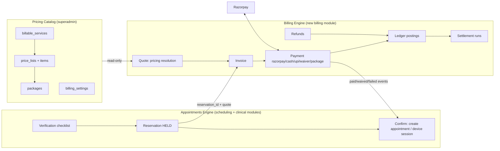

# Anava Payments System — Master Architecture & Implementation Plan

**Version:** v1.0 (Draft for review)
**Date:** 3 August 2026
**Status:** Planning — no schema or code changes made by this document
**Supersedes / builds on:** `Reference-MR/Docs/Anava_Sessions_Appointments_Payments_Plan_v1.docx` (MR Revision 5). Every decision Rev 5 locked is inherited here unchanged and marked `[R5]`. New decisions from the 3 Aug 2026 requirements (superadmin-owned pricing, packages, settlements, offline payments, compliance) are marked `[NEW]`.
**Compliance source:** `Reference-MR/Docs/Anava_Closure_Data_Compliance_Policy_v1.0.docx` ("Policy v1.0") — sections cited as `[Policy §n]`.
**Codebase sources:** `SQL/v1/*` (live schema introspection 2026-07-20), `backend/app/modules/{payments,scheduling,clinical,store,reception}`, `backend/app/integrations/razorpay.py`, `backend/app/core/*`, alembic 0001–0030.

**How to use this document:** This is the source of truth for building the payments block. Each implementation phase (Section 16) is self-contained: point Claude (or any engineer) at the phase, plus Sections 3–8 for the specs it references. Do not implement anything that contradicts a `LOCKED` decision without updating this document first.

---

## Table of Contents

- [0. Executive Summary & Decision Register](#0-executive-summary--decision-register)
- [1. Current-State Analysis (what exists, what's missing, what's broken)](#1-current-state-analysis)
- [2. Target Architecture Overview](#2-target-architecture-overview)
- [3. Database Design — the `billing` schema](#3-database-design)
- [4. Pricing Resolution Engine](#4-pricing-resolution-engine)
- [5. Booking + Payment Flows](#5-booking--payment-flows)
- [6. Refunds, Cancellations, Reschedules, No-Shows, Bad Payments](#6-refund--cancellation-policy)
- [7. Razorpay Integration Specification](#7-razorpay-integration-specification)
- [8. Ledger, Commissions & Settlements](#8-ledger-commissions--settlements)
- [9. API Surface — Complete Endpoint Catalog](#9-api-surface)
- [10. Role Capability Matrix](#10-role-capability-matrix)
- [11. Frontend Screens Per Role](#11-frontend-screens-per-role)
- [12. Integration Contracts (scheduling, clinical, store, notifications)](#12-integration-contracts)
- [13. Compliance Implementation (DPDP / GDPR / HIPAA / PCI / RBI / GST / TDS)](#13-compliance-implementation)
- [14. Edge Cases & Failure Modes Catalog](#14-edge-cases--failure-modes)
- [15. Scalability & Long-Term Lifecycle](#15-scalability--long-term-lifecycle)
- [16. Implementation Phases (step-by-step)](#16-implementation-phases)
- [17. Open Decisions Requiring Confirmation](#17-open-decisions)
- [Appendix A. Seed Data](#appendix-a-seed-data)
- [Appendix B. Domain Event Catalog](#appendix-b-domain-event-catalog)
- [Appendix C. Error Code Catalog](#appendix-c-error-code-catalog)

---

## 0. Executive Summary & Decision Register

### 0.1 What is being built

A complete payments block for the Anava platform covering:

1. **Superadmin-owned pricing catalog** — base prices for New Consultation / Follow-Up appointments and per-session prices for every neuromodulation device (tDCS, HD-tDCS, TPS, rTMS, taVNS, extensible), with scoped overrides per **region → clinic → doctor**, seasonal/date-windowed price lists, and follow-up tapering (e.g. follow-up = 70% of new consultation).
2. **Bundles/packages** — e.g. 20 or 30 tDCS sessions purchased upfront at a 10%/20%/30% bulk discount, tracked as a session entitlement balance that device-session bookings consume.
3. **A reservation-then-payment booking wall** `[R5]` — every billable appointment and device session goes *verify → reserve → pay → confirm*; free/waived units skip the payment leg.
4. **Two payment channels** — in-app **Razorpay** (cards/UPI/netbanking/wallets) and **at-clinic cash/UPI** recorded by the receptionist, both landing in the same invoice/payment ledger.
5. **Refunds, reschedules, no-show policy** — real Razorpay refund API calls `[R5]`, policy-driven auto/manual approval, doctor-no-show full refunds, payment carry-over on reschedule.
6. **Ledger + settlements** — double-entry postings per financial event, commission schemes per party (doctor / clinic owner / investor / platform), monthly or quarterly settlement runs with statements.
7. **Compliance** — DPDP-first (with HIPAA alignment and GDPR readiness) handling of payment data per Policy v1.0: 8-year financial retention, erasure-request classification, audit trails, PCI SAQ-A posture (no card data ever stored), RBI payment-data localization.

### 0.2 Decision register

| # | Decision | Status | Source |
|---|----------|--------|--------|
| D1 | Exactly two billable clinical units: **Appointment** (doctor consultation) and **Device Session** (CA-administered). No dependency graph or branch rules. | LOCKED | `[R5]` |
| D2 | **Two-engine split**: Appointments Engine (booking/verification) and Payments Engine (money) communicate only through a shared **reservation** record. Neither writes the other's tables. | LOCKED | `[R5]` |
| D3 | Booking always goes **verify → reserve → pay (if billable) → confirm**. No path skips verification. | LOCKED | `[R5]` |
| D4 | **3-tier billing**: (1) consultation fee per appointment, (2) per-session fee per device session, (3) external/pharmacy — untracked, out of scope. Never mixed into one line item. | LOCKED | `[R5]` |
| D5 | Refunds are **real gateway calls**, never just a status flip. | LOCKED | `[R5]` |
| D6 | Cancel/reschedule windows are **dynamic, superadmin-configurable**, seeded from live 2h cancel / 24h reschedule-request defaults. | LOCKED | `[R5]` |
| D7 | **All pricing configuration is superadmin-owned** `[NEW — supersedes R5's "Clinic Admin configurable" for the follow-up %]`. Clinic admins, regional admins, receptionists **select only**; they have zero price-customisation access. | LOCKED | 3 Aug 2026 requirements |
| D8 | Price scoping precedence: **doctor > clinic > region > global**, most specific active price list wins. Price lists carry validity windows (seasons/cycles). | LOCKED | `[NEW]` |
| D9 | Seed prices: New Consultation ₹1,500 · Follow-Up 70% of New Consultation · tDCS session ₹2,000 · bulk packages at 10/20/30% tiers. All seed values are placeholders pending founder confirmation (§17). | PROVISIONAL | `[NEW]` |
| D10 | Offline payments (cash / UPI at reception) are **first-class payment methods** recorded by the receptionist against the same invoice as online payments. | LOCKED | `[NEW]` |
| D11 | Settlements to doctors/clinic owners/investors are computed from a **double-entry ledger**, run monthly or quarterly, with statements. | LOCKED | `[NEW]` |
| D12 | Payment data retention: financial/billing records **8 years from transaction date**, gateway responses included; consent/audit **10 years**. | LOCKED | `[Policy §6.2, §6.3]` |
| D13 | New `billing` schema in Postgres for all new payments-domain tables; existing `core.payments` is migrated into it and retired (kept as a compatibility view during transition). | PROPOSED | this doc §3.1 |
| D14 | A **money document ("invoice")** anchors every charge; payments/refunds/waivers hang off invoices, not directly off appointments. | PROPOSED | this doc §3.4 |
| D15 | Reservation hold window: **10 minutes** default, superadmin-configurable per unit type. | PROPOSED (R5 left open) | `[R5 §7.2]` |
| D16 | Home Sessions and the device e-cart (next phase) plug into the same invoice/payment spine via `service_type = 'home_session'` and `'product'`. Designed now, implemented next phase. | PROPOSED | `[NEW]` |
| D17 | Custom Admin (Bible Flow Y): read-only cross-clinic visibility over invoices/payments/settlement data for clinics on their access list. No create/modify. | LOCKED | `[R5 §8]` |

### 0.3 What this plan explicitly does NOT cover

- Tier-3 external/pharmacy payments (never tracked) `[R5]`.
- Insurance claims / TPA integration (future; the invoice model leaves room via `payer_type`).
- Multi-currency checkout (schema is currency-aware; only INR is active in Phase 1–6).
- Accounting-system export (Tally/Zoho) — the ledger is designed so an export job can be added without schema change (§15).

---

## 1. Current-State Analysis

### 1.1 What exists today (DB)

| Table | Relevant columns | Assessment |
|---|---|---|
| `core.payments` | `session_id`, `order_id`, `idempotency_key`, `razorpay_order_id/payment_id`, `amount`, `currency`, `payment_method`, `status` (text: pending/paid/failed/waived/refunded), `gateway_response`, `waived_by/reason`, `paid_at` | Skeleton only. No `patient_id`, no `clinic_id` (scoping needs a two-hop join through `sessions`/`store_orders`), no link to appointments, no tier, no tax/discount, no refund records, no collected-by for offline payments. |
| `core.appointments` | full lifecycle: `scheduled → confirmed → checked_in → in_progress → completed / no_show / cancelled`; reschedule creates a **new row** (`rescheduled_from/to`); `appointment_type` (text, default `initial_assessment`); `booked_by/_role`; audit table partitioned monthly | Mature. **No payment linkage of any kind.** `appointment_type` does not yet distinguish new-consultation vs follow-up for pricing. |
| `core.appointment_requests` | patient request → staff decision → creates appointment | Mature. Payment must slot between "decision: approved" and "appointment confirmed" (§5). |
| `core.sessions` | `payment_status` TEXT (free text, no constraint, nothing writes it today) | Legacy column; superseded by the invoice linkage in this plan. |
| `core.treatment_plans` | `device_type` TEXT, `sessions_prescribed`, `standard_sessions`, `extended_sessions` | The clinical anchor for device sessions. `device_type` values must align with the billing catalog's device list (§3.3). |
| `core.treatment_sessions` | `billing_type` (standard/extended), `payment_status` (pending/not_required; paid/waived written by PaymentService), partitioned yearly | The only payment gate that works today: extended sessions can't start unless paid/waived. Kept, generalized (§12.2). |
| `core.store_orders` + `core.order_items` + `reference.products` | order FSM `pending_doctor_approval → … → collected_by_patient`, `total_amount`, per-item `unit_price` | E-cart spine for devices/accessories. Next phase: orders will issue invoices through the same billing spine (§12.4). |
| `compliance.*` | `activity_logs`, `audit_logs` (both partitioned monthly), `consent_records`, `erasure_requests`, `data_portability_requests` | Ready to receive billing audit events; erasure classification must learn billing categories (§13). |
| `ops.outbox_events` | transactional outbox → SQS relay | All billing domain events go through this (Appendix B). |

### 1.2 What exists today (backend)

- `app/modules/payments/` — create payment (staff-only), list by clinic, get (patient ownership checked), PATCH status (waive restricted to clinic_admin/super_admin), Razorpay webhook. Uses stub gateway when keys unset.
- `app/integrations/razorpay.py` — order creation + webhook HMAC verify; stub mode returns synthetic order ids.
- `app/modules/scheduling/` — the full appointments engine: availability computation, requests, booking with slot check + DB overlap guard, status FSM with role rules (`_ALLOWED_FROM`, doctor-only statuses), reschedule-as-new-row, audit log, hardcoded `CANCEL_MIN_HOURS = 2`, `RESCHEDULE_REQUEST_MIN_HOURS = 24`.
- `app/modules/clinical/` — cycles, plans, sessions, treatment sessions with the extended-session payment gate.
- `app/core/` — `RequestContext` + SET LOCAL RLS vars, `require_role`, `assert_clinic_scope` / `assert_owns_profile`, outbox `emit_event`, FSM helper, structured exceptions.
- **Convention that MUST be respected:** `patient_id` / `doctor_id` / `ca_id` columns on transactional tables store **`profiles.id`**, not `patients.patient_id` / `doctors.doctor_id`. API paths take the public ids and services resolve via `app/core/resolve.py`. Every new billing table follows this convention.

### 1.3 Defects in the current payments module (fix as part of this build)

| # | Defect | Where | Fix |
|---|--------|-------|-----|
| B1 | **Webhook handler ignores the event type.** Any event whose payload carries an `order_id` — including `payment.failed` — marks the payment **paid**. | `payments/service.py::handle_webhook` | §7.4: dispatch on `body["event"]`; only `payment.captured` / `order.paid` mark paid; `payment.failed` marks failed. |
| B2 | **Webhook signature verified with the wrong secret.** Razorpay webhooks are signed with the *webhook secret* (set in the Razorpay dashboard), not the API `key_secret`. Real-mode verification would reject every genuine webhook. | `integrations/razorpay.py::verify_webhook_signature` | §7.4: new `razorpay_webhook_secret` setting. |
| B3 | **No webhook dedup/journal.** Razorpay retries deliveries for 24h; replays would re-run side effects. | same | §3.7 `gateway_webhook_events` with `provider_event_id` UNIQUE; store-then-process. |
| B4 | `status='refunded'` is a pure status flip; **no gateway refund call exists**. | `payments/service.py::update_status` | §6/§7.5 real refund flow (`[R5 §4.3]` flagged this too). |
| B5 | `update_status` enforces **no state machine** — `paid → pending`, `waived → paid`, double-waive are all accepted. | same | §3.5 payment FSM + `assert_transition`. |
| B6 | Hardcoded `payment_method="upi"` on every webhook capture regardless of actual instrument. | `handle_webhook` | Read `payload.payment.entity.method`. |
| B7 | `amount` is `float` end-to-end (router → service → gateway `int(amount*100)`) — float paise conversion can be off by 1p. | schemas/service | Use `Decimal` end-to-end; convert to paise with `int((amount * 100).to_integral_value())`. |
| B8 | Payments carry no `created_by`, no channel, no receipt numbering — cash logging is impossible to audit. | schema | §3.5 columns. |
| B9 | RLS: patients cannot SELECT their own payments (`rls_payments_select` has no patient arm), yet the API exposes GET to patients (works only because the deployed role bypasses RLS). | `SQL/v1/17_rls_policies.sql` | §3.9 policies include patient-self arm. |

### 1.4 The RLS caveat (inherited, affects every new table)

Per `app/config.py` and `app/core/scoping.py`: the deployed app role currently connects as a Postgres superuser and **bypasses RLS entirely**; app-layer scoping (`assert_clinic_scope`, `assert_owns_profile`, role filters in list endpoints) is the *only* live enforcement. This plan still ships complete RLS policies for every billing table (defense-in-depth, and they become live the day the app moves to a `NOBYPASSRLS` role), but **every endpoint must carry its own app-layer scope checks** as if RLS did not exist.

---

## 2. Target Architecture Overview

### 2.1 The three cooperating parts



- The **Appointments Engine** already exists (`scheduling` + `clinical` modules). It gains: a verification-checklist step, reservation creation, and a confirm step triggered by payment outcome. It never writes billing tables. `[R5 §2]`
- The **Billing Engine** is a new `billing` module (`app/modules/billing/`) owning quotes, invoices, payments, refunds, packages, ledger, settlements. It never writes appointments/sessions directly — it updates the shared reservation and emits events; the Appointments Engine (and the existing `treatment_sessions.payment_status` hook) reacts.
- The **Pricing Catalog** is superadmin-only configuration read by the quote step.

### 2.2 Module layout (backend)

```
app/modules/billing/
    __init__.py
    router_catalog.py      # superadmin: services, price lists, packages, settings, commission schemes
    router_billing.py      # quotes, reservations-checkout, invoices, payments, refunds
    router_settlements.py  # settlement runs, statements, ledger reports
    schemas.py             # pydantic models (split per router if it grows)
    service_catalog.py     # catalog CRUD + validation
    service_pricing.py     # THE pricing resolution engine (pure logic + repo reads)
    service_billing.py     # invoices, payments, refunds, waivers, package redemption
    service_settlements.py # ledger postings, commission calc, settlement runs
    repository.py          # raw-SQL repositories, one class per aggregate
app/modules/scheduling/    # gains: reservation + verification integration (§12.1)
app/workers/
    billing_expiry.py      # releases expired reservations, expires packages, dunning marks
    billing_recon.py       # daily Razorpay settlement reconciliation (§7.6)
app/integrations/razorpay.py  # extended: webhook secret, refunds, payment fetch, settlements fetch
```

The existing `app/modules/payments/` module is **absorbed** by `billing` (routes kept as aliases during migration, then removed — §16 Phase 3).

### 2.3 Design principles

1. **Price is snapshotted, never referenced live.** An invoice line stores the resolved amounts *and* the provenance (`price_list_item_id`, `package_purchase_id`). Catalog edits never mutate history.
2. **Money rows are append-mostly.** Payments/refunds/ledger entries are never UPDATEd for business meaning beyond their own FSM; corrections are new rows (adjustments, reversals).
3. **Idempotency everywhere money moves.** Client-supplied `Idempotency-Key` on POSTs that create payments/refunds; DB UNIQUE constraints as the last line (§3.5, §3.7).
4. **Webhook is the source of truth for online money** — the frontend "payment success" callback is a fast-path hint, verified server-side, but capture is only trusted from the signature-verified webhook or a direct API fetch (§7.4).
5. **Everything emits outbox events** (Appendix B) — notifications, dashboards, and future analytics all hang off `ops.outbox_events`, consistent with the rest of the platform.
6. **Same RBAC skeleton as every module**: `require_role(...)` + `assert_clinic_scope` / `assert_owns_profile` + (defense-in-depth) RLS.

---

## 3. Database Design

### 3.1 The `billing` schema

All new tables live in a new Postgres schema **`billing`** (alongside `core`, `reference`, `compliance`, `ops`). Rationale: the payments domain has its own lifecycle, retention clock (8 years vs 7 for clinical `[Policy §6]`), access rules, and eventually its own read-replicas/exports; a schema boundary makes grants, RLS review, retention jobs, and the erasure classification pass (§13.4) mechanical instead of pattern-matching table names inside `core`.

Migration mechanics (Phase 1): `CREATE SCHEMA billing;` + add `billing` to the role search_path (`SQL/v1/19_search_path.sql` pattern) + grants mirroring `18_grants.sql` + `16_rls_enable.sql`-style `ENABLE/FORCE ROW LEVEL SECURITY` on every table below. Alembic migrations `0031+` carry the DDL; the corresponding `SQL/v1/3x_*.sql` files are regenerated from the live schema per the repo's introspection convention.

**Conventions (identical to core):** `UUID DEFAULT gen_random_uuid()` PKs · `TIMESTAMPTZ DEFAULT now()` stamps · `patient_id`/`doctor_id`/`ca_id`/`*_by` columns store **`profiles.id`** · money is `NUMERIC(12,2)` + `currency TEXT DEFAULT 'INR'` (never float) · status columns are TEXT + CHECK constraint (matching the codebase's text-status convention) with the FSM enforced in the service layer via `app/core/fsm.py::assert_transition`.

### 3.2 Table inventory (18 tables, by sub-domain)

| Sub-domain | Tables | Phase |
|---|---|---|
| Catalog | `billable_services`, `price_lists`, `price_list_items`, `billing_settings` | 1 |
| Packages | `packages`, `patient_package_purchases`, `package_redemptions` | 5 |
| Booking | `reservations` | 2 |
| Money documents | `invoices`, `invoice_line_items`, `invoice_adjustments`, `invoice_sequences` | 3 |
| Money movement | `payments`, `refunds`, `gateway_webhook_events`, `payment_disputes` | 3–4 |
| Settlement | `ledger_entries`, `commission_schemes`, `parties`, `settlement_runs`, `settlement_statements` | 6 |

### 3.3 Catalog tables

```sql
CREATE TABLE billing.billable_services (
    service_id        UUID PRIMARY KEY DEFAULT gen_random_uuid(),
    service_code      TEXT NOT NULL UNIQUE,          -- 'NEW_CONSULTATION', 'FOLLOWUP_CONSULTATION',
                                                     -- 'DEVICE_SESSION_TDCS', 'DEVICE_SESSION_HD_TDCS',
                                                     -- 'DEVICE_SESSION_TPS', 'DEVICE_SESSION_RTMS',
                                                     -- 'DEVICE_SESSION_TAVNS', 'HOME_SESSION_TDCS', ...
    service_type      TEXT NOT NULL CHECK (service_type IN
                        ('consultation','device_session','home_session','product','other')),
    device_type       TEXT,                          -- NULL for consultations; MUST match
                                                     -- core.treatment_plans.device_type vocabulary
                                                     -- ('tdcs','hd_tdcs','tps','rtms','tavns', ...)
    name              TEXT NOT NULL,
    description       TEXT,
    is_billable       BOOLEAN NOT NULL DEFAULT true, -- [R5 §4.5] billable=No units skip the payment leg
    default_duration_minutes INTEGER,
    tax_rate_percent  NUMERIC(5,2) NOT NULL DEFAULT 0,  -- healthcare services: 0 (GST-exempt);
                                                        -- product sales taxable — see §13.7
    sac_hsn_code      TEXT,                          -- SAC/HSN for invoices; NULL when exempt
    is_active         BOOLEAN NOT NULL DEFAULT true,
    created_by        UUID NOT NULL,                 -- profiles.id (super_admin)
    created_at        TIMESTAMPTZ NOT NULL DEFAULT now(),
    updated_at        TIMESTAMPTZ NOT NULL DEFAULT now()
);
```

Notes: one row per *sellable thing*, stable over time — prices never live here. Adding a new device (user requirement: "other devices that will be added") = one INSERT by superadmin, no code change, provided `device_type` matches the clinical vocabulary. Deactivation (`is_active=false`) blocks new quotes but never touches history.

```sql
CREATE TABLE billing.price_lists (
    price_list_id  UUID PRIMARY KEY DEFAULT gen_random_uuid(),
    name           TEXT NOT NULL,                    -- 'Global Base 2026', 'Pune Monsoon Offer',
                                                     -- 'Clinic KOL-01 premium', 'Dr. X visiting rates'
    scope_type     TEXT NOT NULL CHECK (scope_type IN ('global','region','clinic','doctor')),
    region_id      UUID REFERENCES core.regions(region_id),
    clinic_id      UUID REFERENCES core.clinics(clinic_id),
    doctor_id      UUID,                             -- profiles.id of the doctor
    currency       TEXT NOT NULL DEFAULT 'INR',
    valid_from     DATE NOT NULL,
    valid_until    DATE,                             -- NULL = open-ended; seasons/cycles = bounded windows
    priority       INTEGER NOT NULL DEFAULT 0,       -- tie-breaker inside the same scope level
    status         TEXT NOT NULL DEFAULT 'draft' CHECK (status IN ('draft','active','archived')),
    notes          TEXT,
    created_by     UUID NOT NULL,
    activated_by   UUID,
    activated_at   TIMESTAMPTZ,
    created_at     TIMESTAMPTZ NOT NULL DEFAULT now(),
    updated_at     TIMESTAMPTZ NOT NULL DEFAULT now(),
    CONSTRAINT price_list_scope_target CHECK (
        (scope_type = 'global' AND region_id IS NULL AND clinic_id IS NULL AND doctor_id IS NULL) OR
        (scope_type = 'region' AND region_id IS NOT NULL AND clinic_id IS NULL AND doctor_id IS NULL) OR
        (scope_type = 'clinic' AND clinic_id IS NOT NULL AND doctor_id IS NULL) OR
        (scope_type = 'doctor' AND doctor_id IS NOT NULL)
    )
);

CREATE TABLE billing.price_list_items (
    item_id            UUID PRIMARY KEY DEFAULT gen_random_uuid(),
    price_list_id      UUID NOT NULL REFERENCES billing.price_lists(price_list_id) ON DELETE CASCADE,
    service_id         UUID NOT NULL REFERENCES billing.billable_services(service_id),
    base_amount        NUMERIC(12,2),                -- absolute price; NULL when derived
    derived_from_service_id UUID REFERENCES billing.billable_services(service_id),
    derived_percent    NUMERIC(5,2),                 -- FOLLOWUP = 70.00 % of NEW_CONSULTATION
    taper_schedule     JSONB,                        -- optional dynamic taper, e.g.
                                                     -- [{"from_visit":2,"to_visit":4,"percent":70},
                                                     --  {"from_visit":5,"percent":60}]
    min_amount         NUMERIC(12,2),                -- floor after derivation (protects against ₹0 tapers)
    created_at         TIMESTAMPTZ NOT NULL DEFAULT now(),
    updated_at         TIMESTAMPTZ NOT NULL DEFAULT now(),
    CONSTRAINT price_defined CHECK (base_amount IS NOT NULL OR
                                    (derived_from_service_id IS NOT NULL AND
                                     (derived_percent IS NOT NULL OR taper_schedule IS NOT NULL))),
    CONSTRAINT uq_price_list_service UNIQUE (price_list_id, service_id)
);
```

Resolution semantics are in §4. Derivation (`derived_from_service_id` + percent/taper) resolves against the *same context* (so a clinic override of NEW_CONSULTATION automatically reprices that clinic's follow-ups — exactly the "dynamic tapering cost reduction" requirement).

```sql
CREATE TABLE billing.billing_settings (
    setting_id   UUID PRIMARY KEY DEFAULT gen_random_uuid(),
    scope_type   TEXT NOT NULL DEFAULT 'global' CHECK (scope_type IN ('global','region','clinic')),
    region_id    UUID,
    clinic_id    UUID,
    key          TEXT NOT NULL,
    value        JSONB NOT NULL,
    updated_by   UUID NOT NULL,
    updated_at   TIMESTAMPTZ NOT NULL DEFAULT now(),
    CONSTRAINT uq_setting_scope UNIQUE (key, scope_type, region_id, clinic_id)
);
```

Seeded keys (defaults in Appendix A): `cancel_window_hours.appointment` (2) · `cancel_window_hours.device_session` (2) · `reschedule_request_window_hours` (24) · `reservation_hold_minutes` (10) · `refund_auto_approve_limit_inr` (5000) · `patient_no_show_forfeit_percent` (100) · `doctor_no_show_policy` ("full_refund_or_free_rebook") · `offline_upi_requires_reference` (true) · `dunning_block_on_outstanding` (true) · `package_refund_formula` ("used_at_unbundled_rate"). Resolution: clinic → region → global, first hit wins. This replaces the hardcoded `CANCEL_MIN_HOURS` / `RESCHEDULE_REQUEST_MIN_HOURS` in `scheduling/service.py` `[R5 §3.4, Stage E]`.

### 3.4 Packages (bundles)

```sql
CREATE TABLE billing.packages (
    package_id       UUID PRIMARY KEY DEFAULT gen_random_uuid(),
    package_code     TEXT NOT NULL UNIQUE,           -- 'TDCS_20PACK', 'TDCS_30PACK'
    name             TEXT NOT NULL,
    description      TEXT,
    service_id       UUID NOT NULL REFERENCES billing.billable_services(service_id),
    sessions_count   INTEGER NOT NULL CHECK (sessions_count > 0),
    discount_type    TEXT NOT NULL DEFAULT 'percent' CHECK (discount_type IN ('percent','fixed_total')),
    discount_percent NUMERIC(5,2),                   -- 10 / 20 / 30
    fixed_total_amount NUMERIC(12,2),                -- alternative: hard total price
    validity_days    INTEGER,                        -- entitlement expiry after purchase; NULL = none
    scope_type       TEXT NOT NULL DEFAULT 'global' CHECK (scope_type IN ('global','region','clinic')),
    region_id        UUID,
    clinic_id        UUID,
    valid_from       DATE NOT NULL,
    valid_until      DATE,
    is_active        BOOLEAN NOT NULL DEFAULT true,
    created_by       UUID NOT NULL,
    created_at       TIMESTAMPTZ NOT NULL DEFAULT now(),
    updated_at       TIMESTAMPTZ NOT NULL DEFAULT now()
);
```

Package **price at purchase** = resolved per-session price (§4) × `sessions_count`, minus the discount — so a clinic-scoped session price automatically reprices packages there too. `fixed_total_amount` short-circuits that when superadmin wants a hard number.

```sql
CREATE TABLE billing.patient_package_purchases (
    purchase_id      UUID PRIMARY KEY DEFAULT gen_random_uuid(),
    package_id       UUID NOT NULL REFERENCES billing.packages(package_id),
    patient_id       UUID NOT NULL,                  -- profiles.id
    clinic_id        UUID NOT NULL,                  -- clinic of purchase; redemption clinic rule §17-Q6
    invoice_id       UUID NOT NULL,                  -- the purchase invoice (FK added after invoices DDL)
    sessions_total   INTEGER NOT NULL,
    sessions_used    INTEGER NOT NULL DEFAULT 0 CHECK (sessions_used >= 0 AND sessions_used <= sessions_total),
    status           TEXT NOT NULL DEFAULT 'pending_payment' CHECK (status IN
                       ('pending_payment','active','exhausted','expired','cancelled','refunded')),
    purchased_at     TIMESTAMPTZ,
    expires_at       TIMESTAMPTZ,
    unit_price_snapshot NUMERIC(12,2) NOT NULL,      -- per-session price at purchase (refund math §6.6)
    created_at       TIMESTAMPTZ NOT NULL DEFAULT now(),
    updated_at       TIMESTAMPTZ NOT NULL DEFAULT now()
);

CREATE TABLE billing.package_redemptions (
    redemption_id    UUID PRIMARY KEY DEFAULT gen_random_uuid(),
    purchase_id      UUID NOT NULL REFERENCES billing.patient_package_purchases(purchase_id),
    reservation_id   UUID,                           -- what consumed it
    ts_id            UUID,                           -- core.treatment_sessions row once confirmed
    invoice_id       UUID,                           -- the ₹0 redemption invoice (provenance)
    status           TEXT NOT NULL DEFAULT 'reserved' CHECK (status IN ('reserved','consumed','released')),
    redeemed_at      TIMESTAMPTZ NOT NULL DEFAULT now(),
    released_at      TIMESTAMPTZ,
    released_reason  TEXT
);
```

Redemption is two-step: `reserved` when a booking holds a slot (decrements availability, prevents double-spend of the last session by two parallel bookings), `consumed` on session confirm, `released` (and `sessions_used` decremented) if the booking is cancelled inside the cancel window. `sessions_used` is maintained transactionally with redemption writes; a CHECK plus a nightly consistency job (Phase 5 tests) keeps drift at zero.

### 3.5 Booking + money documents

```sql
CREATE TABLE billing.reservations (          -- [R5 §5] the ONE shared record between engines
    reservation_id   UUID PRIMARY KEY DEFAULT gen_random_uuid(),
    unit_type        TEXT NOT NULL CHECK (unit_type IN ('appointment','device_session')),
    patient_id       UUID NOT NULL,                  -- profiles.id
    clinic_id        UUID NOT NULL,
    doctor_id        UUID,                           -- profiles.id (appointments)
    ca_id            UUID,                           -- profiles.id (device sessions)
    plan_id          UUID,                           -- treatment_plans FK context (device sessions)
    cycle_id         UUID,
    session_number   INTEGER,                        -- device session ordinal within plan
    appointment_type TEXT,                           -- 'new_consultation' | 'follow_up' (appointments)
    slot_date        DATE NOT NULL,
    start_time       TIME NOT NULL,
    end_time         TIME NOT NULL,
    status           TEXT NOT NULL DEFAULT 'held' CHECK (status IN
                       ('held','awaiting_payment','paid','confirmed','expired','released','failed')),
    expires_at       TIMESTAMPTZ NOT NULL,           -- now() + reservation_hold_minutes
    quote_snapshot   JSONB NOT NULL,                 -- full §4 quote breakdown at hold time
    service_id       UUID NOT NULL,
    invoice_id       UUID,                           -- set at checkout
    confirmed_entity_id UUID,                        -- appointment_id or ts_id after confirm
    verification_results JSONB NOT NULL DEFAULT '[]'::jsonb,  -- checklist outcomes [R5 §3.2]
    created_by       UUID NOT NULL,
    created_by_role  TEXT NOT NULL,
    created_at       TIMESTAMPTZ NOT NULL DEFAULT now(),
    updated_at       TIMESTAMPTZ NOT NULL DEFAULT now()
);
-- Slot protection: extend the appointments overlap guard (SQL/v1/12b) so an ACTIVE
-- reservation (held/awaiting_payment/paid) blocks booking the same doctor/CA slot:
CREATE UNIQUE INDEX uq_reservation_active_slot ON billing.reservations
    (COALESCE(doctor_id, ca_id), slot_date, start_time)
    WHERE status IN ('held','awaiting_payment','paid');
```

Reservation FSM: `held → awaiting_payment → paid → confirmed`; `held/awaiting_payment → expired` (worker, past `expires_at`); `held/awaiting_payment → released` (user abandoned / verification revoked); `awaiting_payment → failed` (payment failed terminally). Free/waived units `[R5 §4.5]`: `held → confirmed` directly, `invoice_id` NULL or a ₹0 invoice for audit (we issue the ₹0 invoice — uniform reporting).

```sql
CREATE TABLE billing.invoice_sequences (     -- gapless per-clinic per-FY invoice numbering (GST/audit)
    clinic_id    UUID NOT NULL,
    fiscal_year  TEXT NOT NULL,                      -- '2026-27' (Indian FY Apr–Mar)
    last_number  BIGINT NOT NULL DEFAULT 0,
    PRIMARY KEY (clinic_id, fiscal_year)
);
-- allocation: UPDATE ... SET last_number = last_number + 1 RETURNING under the row lock —
-- serialized per clinic+FY, gapless-by-construction (issue the number only at 'issued', §5.2).

CREATE TABLE billing.invoices (
    invoice_id       UUID PRIMARY KEY DEFAULT gen_random_uuid(),
    invoice_number   TEXT UNIQUE,                    -- 'ANV/<clinic_code>/2026-27/000123'; NULL while draft
    patient_id       UUID NOT NULL,                  -- profiles.id
    clinic_id        UUID NOT NULL,
    region_id        UUID NOT NULL,                  -- denormalized for regional reporting/RLS
    source_type      TEXT NOT NULL CHECK (source_type IN
                       ('reservation','package_purchase','store_order','manual','legacy_migration')),
    source_id        UUID,
    status           TEXT NOT NULL DEFAULT 'draft' CHECK (status IN
                       ('draft','issued','paid','partially_paid','void','refunded','partially_refunded','written_off')),
    currency         TEXT NOT NULL DEFAULT 'INR',
    subtotal         NUMERIC(12,2) NOT NULL DEFAULT 0,
    discount_total   NUMERIC(12,2) NOT NULL DEFAULT 0,
    tax_total        NUMERIC(12,2) NOT NULL DEFAULT 0,
    grand_total      NUMERIC(12,2) NOT NULL DEFAULT 0,
    amount_paid      NUMERIC(12,2) NOT NULL DEFAULT 0,
    amount_refunded  NUMERIC(12,2) NOT NULL DEFAULT 0,
    billing_tier     TEXT CHECK (billing_tier IN ('consultation','device_session','package','product','other')),  -- [R5 §4.2]
    due_at           TIMESTAMPTZ,
    issued_at        TIMESTAMPTZ,
    voided_at        TIMESTAMPTZ,
    void_reason      TEXT,
    pdf_s3_key       TEXT,                           -- generated receipt/invoice PDF (§5.6)
    notes            TEXT,
    created_by       UUID NOT NULL,
    created_by_role  TEXT NOT NULL,
    created_at       TIMESTAMPTZ NOT NULL DEFAULT now(),
    updated_at       TIMESTAMPTZ NOT NULL DEFAULT now()
);

CREATE TABLE billing.invoice_line_items (
    line_id          UUID PRIMARY KEY DEFAULT gen_random_uuid(),
    invoice_id       UUID NOT NULL REFERENCES billing.invoices(invoice_id) ON DELETE CASCADE,
    service_id       UUID NOT NULL,
    description      TEXT NOT NULL,
    quantity         INTEGER NOT NULL DEFAULT 1,
    unit_amount      NUMERIC(12,2) NOT NULL,
    discount_amount  NUMERIC(12,2) NOT NULL DEFAULT 0,
    tax_rate_percent NUMERIC(5,2) NOT NULL DEFAULT 0,
    tax_amount       NUMERIC(12,2) NOT NULL DEFAULT 0,
    line_total       NUMERIC(12,2) NOT NULL,
    reference_type   TEXT,                           -- 'appointment' | 'treatment_session' | 'package_purchase' | 'order_item'
    reference_id     UUID,
    price_list_item_id UUID,                         -- pricing provenance snapshot
    package_purchase_id UUID,                        -- set when settled by package credit (₹0 line)
    created_at       TIMESTAMPTZ NOT NULL DEFAULT now()
);

CREATE TABLE billing.invoice_adjustments (   -- waivers / write-offs, the honest version of status='waived'
    adjustment_id    UUID PRIMARY KEY DEFAULT gen_random_uuid(),
    invoice_id       UUID NOT NULL REFERENCES billing.invoices(invoice_id),
    adjustment_type  TEXT NOT NULL CHECK (adjustment_type IN ('waiver','write_off','goodwill_credit')),
    amount           NUMERIC(12,2) NOT NULL CHECK (amount > 0),
    reason           TEXT NOT NULL,
    approved_by      UUID NOT NULL,                  -- clinic_admin/super_admin (waiver rule preserved)
    created_at       TIMESTAMPTZ NOT NULL DEFAULT now()
);
```

Invoice FSM: `draft → issued → (paid | partially_paid → paid) | void`; `paid → partially_refunded → refunded`; `issued → written_off` (via adjustment). `amount_paid`/`amount_refunded` are maintained by payment/refund FSM transitions in the same transaction (with the invoice row locked `FOR UPDATE`) — they are caches of SUMs, checked by a nightly consistency job.

```sql
CREATE TABLE billing.payments (
    payment_id       UUID PRIMARY KEY DEFAULT gen_random_uuid(),
    invoice_id       UUID NOT NULL REFERENCES billing.invoices(invoice_id),
    patient_id       UUID NOT NULL,                  -- denormalized (profiles.id)
    clinic_id        UUID NOT NULL,                  -- denormalized — kills the two-hop RLS join (§1.1)
    amount           NUMERIC(12,2) NOT NULL CHECK (amount > 0),
    currency         TEXT NOT NULL DEFAULT 'INR',
    method           TEXT NOT NULL CHECK (method IN
                       ('razorpay','cash','upi_offline','card_pos','bank_transfer','package_credit')),
    channel          TEXT NOT NULL CHECK (channel IN ('online','at_clinic','system')),
    status           TEXT NOT NULL DEFAULT 'created' CHECK (status IN
                       ('created','pending','captured','failed','cancelled','expired')),
    idempotency_key  TEXT NOT NULL UNIQUE,
    razorpay_order_id   TEXT UNIQUE,
    razorpay_payment_id TEXT UNIQUE,
    gateway_method_detail TEXT,                      -- actual instrument from gateway: 'upi','card','netbanking',...
    gateway_response JSONB NOT NULL DEFAULT '{}'::jsonb,
    gateway_fee      NUMERIC(12,2),                  -- from settlement recon (§7.6)
    gateway_tax      NUMERIC(12,2),
    collected_by     UUID,                           -- receptionist profiles.id (offline)
    collection_reference TEXT,                       -- UPI UTR / receipt book no / POS ref (offline)
    failure_code     TEXT,
    failure_reason   TEXT,
    paid_at          TIMESTAMPTZ,
    created_by       UUID,                           -- NULL for webhook/system writes
    created_by_role  TEXT NOT NULL,                  -- includes 'system' for webhook path (existing convention)
    created_at       TIMESTAMPTZ NOT NULL DEFAULT now(),
    updated_at       TIMESTAMPTZ NOT NULL DEFAULT now()
);
```

Payment FSM: `created → pending → captured | failed | expired`; `created → cancelled` (user abandoned checkout). Offline payments are created directly as `captured` (money changed hands at the desk) with `collected_by` + `collection_reference` mandatory per `billing_settings.offline_upi_requires_reference`. Waiver is **not** a payment method — it is an `invoice_adjustment` (§3.5) that reduces the balance; `package_credit` **is** a payment method (a ₹0-cash but value-bearing settlement of the line, traceable to the entitlement).

```sql
CREATE TABLE billing.refunds (
    refund_id        UUID PRIMARY KEY DEFAULT gen_random_uuid(),
    payment_id       UUID NOT NULL REFERENCES billing.payments(payment_id),
    invoice_id       UUID NOT NULL REFERENCES billing.invoices(invoice_id),
    amount           NUMERIC(12,2) NOT NULL CHECK (amount > 0),
    reason_code      TEXT NOT NULL CHECK (reason_code IN
                       ('doctor_no_show','clinic_cancelled','patient_cancelled_in_window',
                        'reschedule_credit','duplicate_payment','payment_error','service_not_rendered',
                        'package_prorata','goodwill','other')),
    reason_notes     TEXT,
    status           TEXT NOT NULL DEFAULT 'requested' CHECK (status IN
                       ('requested','pending_approval','approved','rejected','processing','processed','failed')),
    refund_method    TEXT NOT NULL CHECK (refund_method IN ('original_instrument','cash','bank_transfer')),
    razorpay_refund_id TEXT UNIQUE,
    gateway_response JSONB NOT NULL DEFAULT '{}'::jsonb,
    idempotency_key  TEXT NOT NULL UNIQUE,
    initiated_by     UUID NOT NULL,
    initiated_by_role TEXT NOT NULL,
    approved_by      UUID,
    rejected_reason  TEXT,
    payout_reference TEXT,                           -- offline refund proof (cash voucher / NEFT UTR)
    processed_at     TIMESTAMPTZ,
    created_at       TIMESTAMPTZ NOT NULL DEFAULT now(),
    updated_at       TIMESTAMPTZ NOT NULL DEFAULT now()
);
```

Refund FSM: `requested → (auto) approved | pending_approval → approved | rejected`; `approved → processing → processed | failed`. Auto vs manual approval is policy-driven (§6.3). Sum of non-rejected refunds per payment ≤ payment amount (service-enforced under the payment row lock, plus the nightly consistency job).

### 3.6 Disputes

```sql
CREATE TABLE billing.payment_disputes (      -- chargebacks / Razorpay disputes (§6.7)
    dispute_id       UUID PRIMARY KEY DEFAULT gen_random_uuid(),
    payment_id       UUID NOT NULL REFERENCES billing.payments(payment_id),
    provider_dispute_id TEXT UNIQUE,
    amount           NUMERIC(12,2) NOT NULL,
    status           TEXT NOT NULL DEFAULT 'open' CHECK (status IN
                       ('open','under_review','evidence_submitted','won','lost','closed')),
    phase            TEXT,                           -- 'fraud' | 'retrieval' | 'chargeback' | 'pre_arbitration'
    evidence_due_at  TIMESTAMPTZ,
    gateway_payload  JSONB NOT NULL DEFAULT '{}'::jsonb,
    resolved_at      TIMESTAMPTZ,
    created_at       TIMESTAMPTZ NOT NULL DEFAULT now(),
    updated_at       TIMESTAMPTZ NOT NULL DEFAULT now()
);
```

### 3.7 Gateway webhook journal

```sql
CREATE TABLE billing.gateway_webhook_events (
    event_id         UUID PRIMARY KEY DEFAULT gen_random_uuid(),
    provider         TEXT NOT NULL DEFAULT 'razorpay',
    provider_event_id TEXT NOT NULL,                 -- x-razorpay-event-id header
    event_type       TEXT NOT NULL,                  -- 'payment.captured', 'refund.processed', ...
    payload          JSONB NOT NULL,
    signature_valid  BOOLEAN NOT NULL,
    processing_status TEXT NOT NULL DEFAULT 'received' CHECK (processing_status IN
                       ('received','processed','skipped_duplicate','skipped_unhandled','error')),
    processing_error TEXT,
    processed_at     TIMESTAMPTZ,
    received_at      TIMESTAMPTZ NOT NULL DEFAULT now(),
    CONSTRAINT uq_provider_event UNIQUE (provider, provider_event_id)
);
```

Store-then-process (§7.4): the webhook endpoint's only synchronous obligations are signature verification + journal INSERT + side-effect dispatch; a duplicate `provider_event_id` INSERT conflict short-circuits to 200 OK with `skipped_duplicate`.

### 3.8 Ledger & settlements

```sql
CREATE TABLE billing.parties (               -- payout counterparties incl. non-users (investors)
    party_id         UUID PRIMARY KEY DEFAULT gen_random_uuid(),
    party_type       TEXT NOT NULL CHECK (party_type IN ('doctor','clinic_owner','investor','platform')),
    profile_id       UUID,                           -- set for doctors (profiles.id); NULL for external parties
    clinic_id        UUID,                           -- set for clinic_owner parties
    display_name     TEXT NOT NULL,
    pan_number       TEXT,                           -- TDS compliance (§13.8); mask on read
    gstin            TEXT,
    bank_account_ref TEXT,                           -- ONLY a masked reference/last4 — full bank details
                                                     -- live outside the app DB (§13.6)
    contact_email    TEXT,
    is_active        BOOLEAN NOT NULL DEFAULT true,
    created_by       UUID NOT NULL,
    created_at       TIMESTAMPTZ NOT NULL DEFAULT now()
);

CREATE TABLE billing.commission_schemes (
    scheme_id        UUID PRIMARY KEY DEFAULT gen_random_uuid(),
    name             TEXT NOT NULL,
    party_id         UUID NOT NULL REFERENCES billing.parties(party_id),
    scope_type       TEXT NOT NULL CHECK (scope_type IN ('global','region','clinic','doctor')),
    region_id        UUID, clinic_id UUID, doctor_id UUID,
    applies_to_service_type TEXT,                    -- NULL = all; 'consultation' | 'device_session' | ...
    basis            TEXT NOT NULL CHECK (basis IN ('percent_of_net','percent_of_gross','fixed_per_unit')),
    rate             NUMERIC(7,4) NOT NULL,          -- percent (e.g. 60.0000) or ₹ for fixed_per_unit
    effective_from   DATE NOT NULL,
    effective_until  DATE,
    is_active        BOOLEAN NOT NULL DEFAULT true,
    created_by       UUID NOT NULL,
    created_at       TIMESTAMPTZ NOT NULL DEFAULT now()
);

CREATE TABLE billing.ledger_entries (        -- double-entry postings; append-only, partitioned yearly
    entry_id         UUID NOT NULL DEFAULT gen_random_uuid(),
    entry_group_id   UUID NOT NULL,                  -- one balanced group per financial event
    account          TEXT NOT NULL,                  -- 'patient_receivable','clinic_revenue','doctor_earnings',
                                                     -- 'platform_commission','investor_pool','gateway_fees',
                                                     -- 'tax_payable','refunds_payable','package_liability',
                                                     -- 'cash_on_hand','gateway_receivable','write_off_expense'
    direction        TEXT NOT NULL CHECK (direction IN ('debit','credit')),
    amount           NUMERIC(12,2) NOT NULL CHECK (amount > 0),
    currency         TEXT NOT NULL DEFAULT 'INR',
    clinic_id        UUID,
    doctor_id        UUID,
    party_id         UUID,
    invoice_id       UUID, payment_id UUID, refund_id UUID,
    settlement_run_id UUID,
    occurred_at      TIMESTAMPTZ NOT NULL,
    created_at       TIMESTAMPTZ NOT NULL DEFAULT now(),
    PRIMARY KEY (entry_id, created_at)
) PARTITION BY RANGE (created_at);
-- yearly partitions like core.treatment_sessions + _default; maintenance per ops/PARTITION_MAINTENANCE.md

CREATE TABLE billing.settlement_runs (
    run_id           UUID PRIMARY KEY DEFAULT gen_random_uuid(),
    period_start     DATE NOT NULL,
    period_end       DATE NOT NULL,
    frequency        TEXT NOT NULL CHECK (frequency IN ('monthly','quarterly')),
    scope_type       TEXT NOT NULL DEFAULT 'global' CHECK (scope_type IN ('global','region','clinic')),
    region_id        UUID, clinic_id UUID,
    status           TEXT NOT NULL DEFAULT 'draft' CHECK (status IN
                       ('draft','calculating','calculated','under_review','approved','paid','closed','cancelled')),
    totals           JSONB NOT NULL DEFAULT '{}'::jsonb,
    generated_by     UUID, generated_at TIMESTAMPTZ,
    approved_by      UUID, approved_at TIMESTAMPTZ,
    created_at       TIMESTAMPTZ NOT NULL DEFAULT now(),
    CONSTRAINT uq_settlement_period UNIQUE (period_start, period_end, scope_type, region_id, clinic_id)
);

CREATE TABLE billing.settlement_statements (
    statement_id     UUID PRIMARY KEY DEFAULT gen_random_uuid(),
    run_id           UUID NOT NULL REFERENCES billing.settlement_runs(run_id),
    party_id         UUID NOT NULL REFERENCES billing.parties(party_id),
    gross_amount     NUMERIC(14,2) NOT NULL,
    commission_amount NUMERIC(14,2) NOT NULL,
    adjustments_amount NUMERIC(14,2) NOT NULL DEFAULT 0,   -- refund clawbacks from prior periods
    tds_amount       NUMERIC(14,2) NOT NULL DEFAULT 0,     -- §13.8
    net_payable      NUMERIC(14,2) NOT NULL,
    line_detail      JSONB NOT NULL DEFAULT '[]'::jsonb,   -- per-invoice contribution rows
    status           TEXT NOT NULL DEFAULT 'pending' CHECK (status IN ('pending','approved','paid','disputed')),
    paid_at          TIMESTAMPTZ,
    payout_reference TEXT,                                  -- NEFT/RTGS UTR
    statement_pdf_s3_key TEXT,
    created_at       TIMESTAMPTZ NOT NULL DEFAULT now()
);
```

Posting rules are specified in §8.2.

### 3.9 Indexes, RLS, grants (summary — full DDL generated in Phase 1/3 migrations)

**Indexes** (beyond PKs/UNIQUEs above): `invoices(patient_id, created_at DESC)` · `invoices(clinic_id, status, created_at DESC)` · `payments(invoice_id)` · `payments(clinic_id, paid_at DESC)` · `payments(collected_by, created_at)` (day-close screen) · `refunds(status) WHERE status IN ('requested','pending_approval','processing')` · `reservations(status, expires_at) WHERE status IN ('held','awaiting_payment')` (expiry worker) · `price_lists(scope_type, status, valid_from, valid_until)` · `patient_package_purchases(patient_id, status)` · `ledger_entries(entry_group_id)` · `ledger_entries(clinic_id, occurred_at)` · `ledger_entries(party_id, occurred_at)`.

**RLS policy matrix** (defense-in-depth per §1.4; written in `17_rls_policies.sql` style with `rls_user_role()/rls_clinic_id()/rls_region_id()/rls_user_id()`):

| Table | SELECT | INSERT | UPDATE |
|---|---|---|---|
| `billable_services`, `packages`, `price_lists(+items)` active rows | all authenticated roles (read needed to render prices) | super_admin | super_admin |
| `billing_settings` | all staff roles | super_admin | super_admin |
| `reservations` | super_admin/regional_admin(region) ∨ clinic match ∨ `patient_id = rls_user_id()` | staff of clinic + patient (self) | staff of clinic + system |
| `invoices`, `invoice_line_items` | super_admin/regional_admin(region via `region_id`) ∨ `clinic_id = rls_clinic_id()` ∨ `patient_id = rls_user_id()`; doctor: invoices whose line references their appointment | super_admin/clinic_admin/receptionist + system | super_admin/clinic_admin + system |
| `payments` | same as invoices (patient self-arm — fixes B9) | super_admin/clinic_admin/receptionist + system; patient may INSERT `method='razorpay'` rows for own invoice (online checkout) | system + super_admin/clinic_admin |
| `refunds` | same as invoices | staff of clinic + system | clinic_admin/super_admin + system |
| `invoice_adjustments` | same as invoices | clinic_admin/super_admin only (waiver rule) | none (append-only) |
| `patient_package_purchases`, `package_redemptions` | staff-clinic ∨ patient self | staff + system | system + staff of clinic |
| `gateway_webhook_events` | super_admin | system | system |
| `ledger_entries` | super_admin; regional_admin (region), clinic_admin (own clinic aggregate views only via API) | system | none (append-only) |
| `parties`, `commission_schemes`, `settlement_runs`, `settlement_statements` | super_admin (+ doctor: **own** statements via `party.profile_id = rls_user_id()`) | super_admin | super_admin |

**Grants:** mirror `18_grants.sql` — app role gets DML on `billing.*`; no direct grants to any other role.

---

## 4. Pricing Resolution Engine

`service_pricing.py` — one pure function used by *both* the quote endpoint and the superadmin preview endpoint, so what admins preview is byte-identical to what patients are charged.

### 4.1 Inputs / output

```
resolve_price(service_code, patient_id, clinic_id, doctor_id?, on_date, quantity=1) -> Quote
Quote = {
  service_id, service_code, is_billable,
  price_list_id, price_list_item_id, scope_matched,      # provenance
  unit_amount, quantity, discount_amount, tax_rate_percent, tax_amount, line_total,
  derivation: { base_service_code?, base_amount?, percent_applied?, visit_ordinal? },
  package_applicable: { purchase_id, sessions_remaining }?  # device sessions only
}
```

### 4.2 Algorithm

1. **Load service** by code; if `is_active = false` → `SERVICE_INACTIVE`. If `is_billable = false` → return a ₹0 quote flagged `is_billable=false` (booking skips the payment leg `[R5 §4.5]`).
2. **Candidate price lists**: status `active`, `valid_from <= on_date <= COALESCE(valid_until, ∞)`, currency INR, scope matching the context: `doctor_id` match (scope doctor) ∨ `clinic_id` match ∨ clinic's `region_id` match ∨ global.
3. **Pick winner**: order by scope specificity `doctor(3) > clinic(2) > region(1) > global(0)`, then `priority DESC`, then `valid_from DESC`, take the **first list that actually contains an item for this service**. (A doctor-scoped list without a tDCS row does not shadow the clinic list's tDCS price — resolution is per-service, not per-list.)
4. **Compute amount**:
   - `base_amount` set → use it.
   - Derived → resolve `derived_from_service_id` **through this same algorithm** (same context, same date; cycle-guard max depth 2), then apply `derived_percent`, or, if `taper_schedule` present, pick the band containing `visit_ordinal`.
   - `visit_ordinal` (follow-up tapering) = 1 + count of this patient's **completed** appointments with **this doctor** whose invoice status ∈ (paid, partially_refunded) — i.e. paid, delivered consultations. New consultation ⇒ ordinal 1; the taper bands index from 2. *(Whether the count is per-doctor or per-clinic is Q3 in §17; per-doctor is the default because the fee is the doctor's consultation fee `[R5 §4.2]`.)*
   - Apply `min_amount` floor if set. Round half-up to 2 dp (`Decimal`, `ROUND_HALF_UP`).
5. **Tax**: from `billable_services.tax_rate_percent` (0 for exempt healthcare services — §13.7).
6. **Package check** (device sessions only): active `patient_package_purchases` for this patient + service with `sessions_remaining > 0` and not expired → surface in quote; booking will offer "pay with package" (§5.4).
7. **No price found anywhere** → `PRICE_NOT_CONFIGURED` (hard error — a billable service with no resolvable price must block booking loudly, not default to free).

### 4.3 Worked examples (seed data of Appendix A)

| Case | Resolution | Amount |
|---|---|---|
| New consultation, any clinic, no overrides | global list → NEW_CONSULTATION base | ₹1,500.00 |
| Follow-up #2 with same doctor | FOLLOWUP → derived 70% of NEW_CONSULTATION (₹1,500) | ₹1,050.00 |
| Follow-up #2, clinic override NEW_CONSULTATION = ₹2,000 | derivation resolves base in-context | ₹1,400.00 |
| tDCS single session | global DEVICE_SESSION_TDCS | ₹2,000.00 |
| tDCS 20-pack | 20 × ₹2,000 − 10% | ₹36,000.00 |
| tDCS 30-pack | 30 × ₹2,000 − 20% | ₹48,000.00 |
| tDCS session, patient has active 20-pack | package_credit payment path | ₹0 due (1 session debited) |
| "Monsoon offer" region list (priority 10, Jul–Sep) with tDCS ₹1,800 | region beats global; date-window active | ₹1,800.00 |

### 4.4 Catalog governance rules (service-enforced)

- Only `status='draft'` price lists are editable; activation snapshots nothing (items already immutable-in-effect because quotes snapshot) but stamps `activated_by/at` and requires the list to contain ≥1 item.
- Archiving a list never affects issued invoices (they hold snapshots).
- Deleting `billable_services` rows is forbidden — deactivate only (history FKs).
- Every catalog mutation → `compliance.activity_logs` (category `billing_config`) + outbox event (Appendix B) — pricing changes are audit-sensitive `[Policy §6.3]`.
- Overlapping active lists at the same scope are allowed (priority resolves), but the admin UI must surface the effective price via the preview endpoint before activation.

---

## 5. Booking + Payment Flows

### 5.1 Verification checklist `[R5 §3.2]` (Appointments Engine, pre-reservation)

| Check | Verifies | Applies to |
|---|---|---|
| `registration_complete` | `patients.registration_status = 'registration_complete'` | both units |
| `no_outstanding_balance` | no invoice for this patient with status `issued`/`partially_paid` past `due_at` (per `dunning_block_on_outstanding`, §6.8) | all billable units |
| `active_treatment_plan` | `treatment_plans` row exists, status active, device_type matches | device sessions |
| `pretreatment_prs_complete` | mandatory pre-treatment PRS complete | device session #1 only (booking allowed, **check-in blocked** until complete `[R5 §1.4]`) |
| `required_consents_signed` | consent types configured for the unit | configurable per unit |
| `slot_available` | availability engine + overlap guard + active-reservation index (§3.5) | both units |

Failures return the exact failing check + machine code (`VERIFY_FAILED_<CHECK>`) `[R5 §3.1]`.

### 5.2 Online payment flow (patient pays in-app via Razorpay)

```mermaid
sequenceDiagram
    participant P as Patient app
    participant AE as Appointments Engine
    participant BE as Billing Engine
    participant RZ as Razorpay
    P->>AE: POST /reservations (unit, slot)
    AE->>AE: verification checklist (5.1)
    AE->>BE: quote (§4)
    AE-->>P: reservation held (expires 10 min) + quote
    P->>BE: POST /reservations/{id}/checkout {channel: online}
    BE->>BE: invoice draft→issued (number allocated), payment row 'created'
    BE->>RZ: create order (amount paise, receipt=invoice_number, notes={invoice_id,reservation_id})
    BE-->>P: {razorpay_order_id, key_id, amount, prefill}
    P->>RZ: Razorpay Checkout SDK
    RZ-->>P: handler(payment_id, order_id, signature)
    P->>BE: POST /payments/razorpay/verify {order_id, payment_id, signature}
    BE->>BE: HMAC verify → mark pending (fast-path hint)
    RZ->>BE: webhook payment.captured (signed)
    BE->>BE: journal event, payment→captured, invoice→paid, reservation→paid
    BE--)AE: event: reservation_paid
    AE->>AE: reservation→confirmed; CREATE appointment / treatment_session row
    AE--)P: notification: booking confirmed + receipt
```

Key rules:

- The invoice number is allocated at `issued` (checkout), not at draft — aborted checkouts before issue don't consume numbers; a checkout that issues and then expires is **voided** (`void_reason='reservation_expired'`), which is legitimate and auditable.
- `payment.captured` after reservation expiry: **grace re-confirm** — if the slot is still free, confirm anyway; else auto-refund `reason_code='payment_error'` (§14 E3).
- The appointment/`treatment_session` row is created only at confirm `[R5 §5 step 5]` — no half-booked states.
- Confirm also back-fills `reservations.confirmed_entity_id` and writes the appointment's `reservation_id` (new nullable column on `core.appointments`, §12.1).

### 5.3 At-clinic payment flow (cash / UPI at reception)

1. Receptionist books via existing flows (or approves an appointment request); a reservation is created the same way (staff-created reservations get a longer configurable hold, default 60 min, key `reservation_hold_minutes.staff`).
2. Receptionist opens the **Collect Payment** screen → `POST /invoices/{id}/payments` with `method: cash | upi_offline | card_pos`, `amount`, `collection_reference` (UTR mandatory for UPI per settings; receipt-book no for cash).
3. Payment row created directly as `captured`, `channel='at_clinic'`, `collected_by=ctx.user_id`. Invoice recomputes → `paid` → reservation → `confirmed` → unit created. Receipt PDF generated (§5.6); patient gets an in-app notification + downloadable receipt.
4. **Split/partial payments** are supported at the desk (e.g. ₹1,000 cash + ₹500 UPI): invoice sits `partially_paid` until balance zero; confirmation fires only at `paid`.
5. Cash accountability: the **day-close view** (§11 receptionist) lists every `collected_by=me, paid_at::date=today` payment by method with totals — the reconciliation sheet the clinic admin countersigns. No schema beyond `payments` is needed; countersign is an activity-log entry (Phase 4 could add a `cash_day_close` table if clinics want hard sign-off — §17 Q8).

### 5.4 Package purchase & redemption

- **Purchase**: `POST /package-purchases {package_id, patient_id}` (patient self-serve or receptionist) → invoice (`billing_tier='package'`, line = package price per §4.3) → pay online/offline as above → purchase `active`, `expires_at = paid_at + validity_days`. Ledger posts the amount to `package_liability` (unearned revenue — money received for undelivered sessions; §8.2).
- **Redemption**: when booking a device session, quote surfaces `package_applicable`; checkout with `{use_package: purchase_id}` → ₹0 invoice with `package_purchase_id` on the line, payment row `method='package_credit', amount` = per-session snapshot value **posted as revenue recognition** (liability → revenue), redemption `reserved → consumed` at confirm. Cancellation in-window → redemption `released`, session returned.
- Concurrency: `sessions_used` incremented under `SELECT ... FOR UPDATE` of the purchase row — two simultaneous bookings can't both take the last session.

### 5.5 Waived / free units `[R5 §4.5]`

- `is_billable=false` service → reservation confirms immediately; ₹0 invoice issued for uniform reporting.
- Ad-hoc waiver of a billable unit: clinic_admin/super_admin only (preserves today's rule) → `invoice_adjustments(type='waiver')` for the open balance → invoice `paid` (balance zero) → confirm proceeds. Waiver amount posts to `write_off_expense` in the ledger so waived revenue is visible in settlement reporting, not silently vanished.

### 5.6 Receipts & documents

- Every `paid` invoice generates a PDF (receipt/invoice) to S3 via the existing `integrations/s3.py` presigned-URL pattern: clinic letterhead data, invoice number, line items, taxes (or exemption note), payments received (method + reference), refunds. Regenerated on refund (amended receipt).
- Patients access documents from their invoice list; staff from the invoice detail; statements from settlement runs (§8).

---

## 6. Refund & Cancellation Policy

### 6.1 Policy matrix (defaults; every number is a `billing_settings` key — superadmin-tunable)

| Trigger | Who initiates | Refund | Approval | Notes |
|---|---|---|---|---|
| **Doctor no-show** | staff marks appointment `no_show_doctor` (§12.1) | 100%, `reason_code='doctor_no_show'` — **or** patient chooses free reschedule (priority slot) | **Auto** | `[NEW]` explicit user requirement. Notification offers the choice; default to refund if no choice in 72h. |
| Clinic cancels (doctor unavailable, closure) | staff cancel with reason | 100% `clinic_cancelled` — or free reschedule | Auto | Includes Policy §5.2 clinic-closure "refunds for prepaid sessions that cannot be honoured". |
| Patient cancels **≥ cancel window** (2h default) | patient | 100% `patient_cancelled_in_window` | Auto ≤ `refund_auto_approve_limit_inr` (₹5,000); else clinic_admin approval | Gateway fees absorbed by clinic (standard healthcare practice; configurable `refund_deduct_gateway_fee=false`). |
| Patient cancels **< window** | patient (blocked today; §6.2 allows with forfeit) | 0% default (`patient_no_show_forfeit_percent=100`); goodwill override by clinic_admin | Manual | Forfeited amount stays `clinic_revenue`. |
| Patient no-show | staff marks `no_show` | 0% default; goodwill path | Manual | |
| Reschedule (either side, within policy) | per §6.4 | **No refund — payment carries over** | n/a | |
| Duplicate payment | system-detected (§14 E6) / receptionist | 100% of duplicate `duplicate_payment` | Auto | |
| Captured-after-expiry, slot gone | system | 100% `payment_error` | Auto | §5.2 grace rule first. |
| Service not rendered (session aborted mid-way) | doctor/CA report → clinic_admin | full or partial `service_not_rendered` | Manual | |
| Package pro-rata (§6.6) | patient request / closure flows | formula §6.6 | Manual (clinic_admin) | |

### 6.2 Cancellation windows `[R5 §3.4]`

`cancel_window_hours.appointment` / `.device_session` (seed 2h) and `reschedule_request_window_hours` (seed 24h) move from code constants to `billing_settings`, resolved clinic → region → global. `scheduling/service.py` reads them through a `BillingSettingsService` (with in-process TTL cache, 60s). Patients keep today's rule: direct cancel allowed only outside the window; inside the window the UI offers "request clinic assistance" (staff can still cancel with the forfeit policy applied).

### 6.3 Refund execution

1. Trigger (§6.1) creates `refunds` row `requested` with computed amount.
2. Policy gate: auto-approvable → `approved`; else `pending_approval` → clinic_admin/super_admin decision (regional_admin may approve for clinics in region — §10).
3. `approved` → worker (or inline for auto) calls Razorpay refund API (§7.5) for `method='razorpay'` payments → `processing`; offline payments → `refund_method='cash'|'bank_transfer'` with mandatory `payout_reference` captured by the receptionist/admin → `processed` on entry.
4. `refund.processed` webhook (or status poll fallback) → `processed`; invoice `amount_refunded` updated → `partially_refunded`/`refunded`; ledger reversal posts; patient notified with amended receipt.
5. SLA: initiate within 24h of trigger; surface "5–7 business days to your account" messaging (gateway norm). Refund aging monitor alerts on `processing > 7 days` (§15.4).

### 6.4 Reschedule with payment carry-over

Reschedule already creates a new appointment row (`rescheduled_from/to`). Billing: the invoice line's `reference_id` is **re-pointed to the new appointment** in the same transaction (service `relink_invoice_reference(old_id, new_id)`), an activity-log entry records the relink, and no money moves. Fee difference edge (price changed between bookings): carry-over keeps the original price — the quote was a contract (§14 E9). Reschedule count limits: none by default; `max_paid_reschedules` setting exists (NULL = unlimited) if abuse appears.

### 6.5 No-show semantics (new distinction needed)

Today `no_show` is a single status meaning *patient* no-show. Doctor no-show `[NEW]` is recorded as a **cancellation with `cancellation_reason='doctor_no_show'`** by staff (avoids widening the appointment FSM), which the Billing Engine maps to the automatic 100% refund/reschedule-choice flow. Audit trail: appointment audit log (existing) + refund record + activity log.

### 6.6 Package refunds

`refund = amount_paid − (sessions_used × unit_price_snapshot)` floored at 0 (used sessions are charged at the **unbundled** rate — standard bulk-package practice; the discount existed for commitment that wasn't kept). Purchase → `refunded`/`cancelled`; remaining redemptions blocked. Formula key: `package_refund_formula` (§17 Q7 offers the alternative: pro-rata at discounted rate).

### 6.7 Disputes / chargebacks

`payment.dispute.created` webhook → `payment_disputes` row + **immediate** clinic_admin + super_admin notification (evidence deadlines are short). Evidence (invoice PDF, consent, appointment audit trail, session completion record) is exactly what the platform already stores. `lost` → ledger clawback posting + invoice `written_off` if service was rendered. Fraud-pattern flag (repeat disputes per patient) → account review queue (§17 Q9).

### 6.8 Bad payments / dunning

- **Pending-at-gateway** (UPI approved-but-not-captured limbo): payment stays `pending` max 30 min (worker polls gateway once at T+15m), then `failed` + reservation released; a later capture webhook follows §5.2's grace rule.
- **Outstanding balances**: possible only via staff-recorded partial payments or post-service billing; `no_outstanding_balance` check (§5.1) blocks *new* bookings while any invoice is past `due_at` unpaid (`dunning_block_on_outstanding=true`). Receptionist sees the outstanding flag on the patient card; override requires clinic_admin (logged `dunning_override`).
- **Reminder ladder** (Phase 4): notification at due_at−24h, due_at, +3d, +7d via the notifications module; no external collections.

---

## 7. Razorpay Integration Specification

### 7.1 Settings (extend `app/config.py`)

```python
razorpay_key_id: str | None = None
razorpay_key_secret: str | None = None
razorpay_webhook_secret: str | None = None   # NEW — dashboard webhook secret (fixes B2)
razorpay_account_currency: str = "INR"
```

Secrets live in AWS Secrets Manager in deployed envs (injected as env vars); never in the repo. Stub mode (all three unset) keeps working exactly as today for local dev — synthetic order ids, webhook signature check bypassed, plus a new stub refund id.

### 7.2 Client wrapper (`integrations/razorpay.py` — extended surface)

| Function | Razorpay API | Notes |
|---|---|---|
| `create_order(amount_paise:int, receipt, notes)` | `POST /orders` | `payment_capture=1` (auto-capture — no manual-capture limbo). Amount is **int paise** computed from `Decimal` (fixes B7). `notes={invoice_id, reservation_id, clinic_id}` so every gateway object is traceable back. |
| `verify_checkout_signature(order_id, payment_id, signature)` | HMAC-SHA256 of `order_id|payment_id` with `key_secret` | Fast-path verify (§5.2). |
| `verify_webhook_signature(payload, signature)` | HMAC-SHA256 of raw body with **`webhook_secret`** | Fixes B2. |
| `fetch_payment(payment_id)` | `GET /payments/:id` | Poll fallback + recon. |
| `create_refund(payment_id, amount_paise, notes, speed='normal')` | `POST /payments/:id/refund` | Partial refunds supported; `speed='optimum'` optional later. |
| `fetch_refund(refund_id)` | `GET /refunds/:id` | Status poll fallback. |
| `fetch_settlements(from, to)` / `fetch_settlement_recon(day)` | Settlements APIs | Daily recon (§7.6). |

### 7.3 Frontend checkout contract

`POST /reservations/{id}/checkout` returns `{key_id, razorpay_order_id, amount_paise, currency, prefill: {name, email, contact}, notes, theme}` → frontend loads `checkout.js`, opens Checkout, and on handler success calls `POST /payments/razorpay/verify`. On modal dismiss → `POST /payments/{id}/cancel` (payment `cancelled`, reservation stays `awaiting_payment` until expiry so the user can retry — a retry issues a **new payment row + new order** against the same invoice, §14 E5).

### 7.4 Webhook processing (rewrite of `handle_webhook` — fixes B1/B3/B6)

Subscribed events: `payment.captured`, `payment.failed`, `order.paid`, `refund.created`, `refund.processed`, `refund.failed`, `payment.dispute.created`, `payment.dispute.won`, `payment.dispute.lost`.

```
1. Verify signature with webhook_secret. Invalid → 400, journal signature_valid=false (alarm §15.4).
2. INSERT gateway_webhook_events (provider_event_id = X-Razorpay-Event-Id header).
   ON CONFLICT → return 200 'skipped_duplicate' (Razorpay retries for 24h; must be idempotent).
3. Dispatch on body["event"]:
   payment.captured / order.paid → locate payment by razorpay_order_id; assert_transition to
       'captured' (already captured → no-op OK); set gateway_method_detail from entity.method;
       invoice recompute under FOR UPDATE; reservation → paid; emit events; ledger postings.
   payment.failed → payment 'failed' + failure_code/description; reservation stays awaiting_payment
       (user may retry until expiry).
   refund.processed / refund.failed → refund FSM + invoice recompute + ledger.
   payment.dispute.* → §6.7.
   unhandled → journal 'skipped_unhandled', 200.
4. Any processing exception → journal 'error' + re-raise 500 (Razorpay will retry; step 2's
   conflict-path must therefore only short-circuit on processed status, not on 'error').
5. RLS context: SET LOCAL role 'system' (existing convention in payments/service.py).
```

Ordering hazard: `refund.processed` can arrive before `payment.captured` on flaky retries — handlers must tolerate out-of-order by fetching current gateway state (`fetch_payment`) when the local FSM rejects a transition (§14 E8).

### 7.5 Refund calls

Refund worker takes `approved` refunds: `create_refund(razorpay_payment_id, amount_paise, notes={refund_id, invoice_id, reason_code})` with `idempotency_key` as the Razorpay `X-Razorpay-Idempotency` header → store `razorpay_refund_id`, status `processing`. Terminal state from webhook or T+24h poll. Gateway errors: `insufficient balance in merchant account` → retry with backoff + super_admin alarm (settlement money hasn't arrived yet — §14 E11).

### 7.6 Reconciliation (worker `billing_recon.py`, daily 06:00 IST)

1. Fetch previous day's settlement recon from Razorpay → per-payment `fee`/`tax`/`settlement_utr`.
2. Match to `payments` by `razorpay_payment_id` → write `gateway_fee`, `gateway_tax`; post `gateway_fees` ledger entries; unmatched gateway rows or local `captured` rows missing from gateway → **reconciliation exceptions report** → super_admin notification (never auto-mutate money on recon).
3. Cross-check: local `pending` payments older than 30 min → `fetch_payment` → settle FSM.

---

## 8. Ledger, Commissions & Settlements

### 8.1 Why a ledger

Settlements ("commissions and other counterparts of the business/doctors/investors receive the settlements quarterly or monthly after the calculations are done" `[NEW]`) cannot be computed reliably from payment rows alone once refunds, waivers, packages (unearned revenue), gateway fees, and TDS enter the picture. A minimal double-entry ledger makes every rupee traceable and every settlement statement reproducible.

### 8.2 Posting rules (each = one balanced `entry_group_id`)

| Event | Debit | Credit |
|---|---|---|
| Invoice issued | `patient_receivable` | `clinic_revenue` (consultation/device tier) or `package_liability` (package tier) |
| Payment captured (online) | `gateway_receivable` | `patient_receivable` |
| Payment captured (cash/UPI at clinic) | `cash_on_hand` | `patient_receivable` |
| Gateway settlement recon | `bank` + `gateway_fees` (+`gateway_tax`) | `gateway_receivable` |
| Package session consumed | `package_liability` (1 session at snapshot) | `clinic_revenue` |
| Refund processed | `clinic_revenue` (or `package_liability`) | `refunds_payable` → cleared on processed |
| Waiver / write-off | `write_off_expense` | `patient_receivable` |
| Settlement run approved | `clinic_revenue` split | `doctor_earnings` / `platform_commission` / `investor_pool` per scheme |
| Settlement paid | `doctor_earnings` etc. | `bank` |
| Dispute lost | `write_off_expense` | `bank` |

### 8.3 Commission resolution

Per captured-revenue line: find active `commission_schemes` matching (doctor > clinic > region > global; service-type filter; effective window at `occurred_at`). Multiple parties may match one line (doctor 60% + platform 25% + investor 15%); the run validates Σ shares ≤ 100% and books the remainder to `clinic_revenue` retained. Basis: `percent_of_net` = gross − refunds − gateway fees (default); `percent_of_gross`; `fixed_per_unit`.

### 8.4 Settlement run lifecycle

1. `POST /settlement-runs {period, frequency, scope}` (super_admin; or cron-created draft monthly).
2. `calculating`: aggregate ledger for the period → per-party statements with `line_detail` (per-invoice contributions), refund **clawbacks** from prior-period reversals, TDS (§13.8).
3. `calculated → under_review`: super_admin reviews statements (regional/clinic admins get read-only visibility of their scope).
4. `approved`: postings written; statements PDF'd to S3; parties notified (doctors in-app; investors via email export).
5. `paid`: payout executed **outside the platform** (bank NEFT/RTGS) — operator records `payout_reference` per statement; run `closed`. (RazorpayX auto-payout is a §17 Q10 option, not in scope.)
6. Immutability: an approved run is never edited — corrections post into the next period as adjustments.

---

## 9. API Surface

All under `/api/v1`. Every endpoint: `require_role(...)` + scope assertions per §10; mutations emit outbox events (Appendix B) and activity logs. `Idempotency-Key` header honored on ★-marked money mutations (stored on the row's `idempotency_key`).

### 9.1 Catalog (superadmin console) — `router_catalog.py`

| Method & path | Role | Purpose |
|---|---|---|
| `GET/POST /billing/services`, `GET/PATCH /billing/services/{id}` | super_admin (GET: all staff) | Billable services CRUD (no DELETE — deactivate) |
| `GET/POST /billing/price-lists`, `GET/PATCH /billing/price-lists/{id}` | super_admin (GET: all staff, active only) | Price lists; PATCH only while draft |
| `POST /billing/price-lists/{id}/items`, `PATCH/DELETE .../items/{item_id}` | super_admin | Items; draft lists only |
| `POST /billing/price-lists/{id}/activate` / `.../archive` | super_admin | Lifecycle |
| `GET /billing/price-resolution` `?service_code&clinic_id&doctor_id&patient_id&on_date` | super_admin, regional_admin, clinic_admin, receptionist | **Preview = production resolution** (§4) |
| `GET/POST /billing/packages`, `GET/PATCH /billing/packages/{id}` | super_admin (GET: all staff + patient, active in-scope only) | Package definitions |
| `GET/PUT /billing/settings` `?scope_type&region_id&clinic_id` | super_admin (GET: all staff) | Settings K/V |
| `GET/POST /billing/commission-schemes`, `PATCH .../{id}` | super_admin | Commission config |
| `GET/POST /billing/parties`, `PATCH .../{id}` | super_admin | Payout parties (PAN masked on read) |

### 9.2 Booking & checkout — `router_billing.py` (+ scheduling integration §12.1)

| Method & path | Role | Purpose |
|---|---|---|
| `POST /billing/quotes` | all staff + patient (self) | Resolve price for a prospective unit (§4) |
| `POST /reservations` | all staff + patient (self) | Verify (§5.1) + hold slot ★ |
| `GET /reservations/{id}` / `GET /reservations?patient_id&status` | scoped per §10 | Status polling |
| `POST /reservations/{id}/checkout` `{channel, use_package?}` | patient (self), receptionist, clinic_admin | Issue invoice; online → Razorpay order params; package → redeem (§5.4) ★ |
| `POST /reservations/{id}/release` | creator or clinic staff | Abandon hold |
| `POST /payments/razorpay/verify` | patient (self), staff | Checkout fast-path signature verify |
| `POST /payments/{id}/cancel` | payment creator | Abandoned checkout |
| `POST /webhooks/razorpay` | public (HMAC-authed) | §7.4 (existing PUBLIC_PATH, rewritten handler) |

### 9.3 Invoices, payments, refunds

| Method & path | Role | Purpose |
|---|---|---|
| `GET /invoices` `?patient_id&clinic_id&status&date_from&date_to&billing_tier&skip&limit` | scoped per §10 | List (patient: own only, forced) |
| `GET /invoices/{id}` (+ `/pdf` presigned) | scoped | Detail + document |
| `POST /invoices/{id}/payments` `{method, amount, collection_reference}` | receptionist, clinic_admin, super_admin | **Record offline payment** (§5.3) ★ |
| `POST /invoices/{id}/adjustments` `{type, amount, reason}` | clinic_admin, super_admin | Waiver / write-off (§5.5) ★ |
| `POST /invoices/{id}/void` | clinic_admin, super_admin | Unpaid invoices only |
| `GET /payments` `?clinic_id&method&status&collected_by&date` | staff scoped | Collections list / day-close |
| `GET /payments/{id}` | scoped incl. patient self | Detail |
| `POST /payments/{id}/refunds` `{amount, reason_code, reason_notes, refund_method}` | staff scoped (patient: via cancel flows only) | Create refund request ★ |
| `GET /refunds` `?status&clinic_id` / `GET /refunds/{id}` | staff scoped | Queue + detail |
| `PATCH /refunds/{id}/decision` `{decision: approved\|rejected, notes}` | clinic_admin, regional_admin (region), super_admin | Manual approval gate (§6.3) |
| `PATCH /refunds/{id}/mark-processed` `{payout_reference}` | clinic_admin, super_admin | Offline refunds only |
| `GET /patients/{patient_id}/billing-summary` | staff scoped + patient self | Outstanding, history, active packages — powers patient card + dunning flag |

### 9.4 Packages (entitlements)

| Method & path | Role | Purpose |
|---|---|---|
| `POST /package-purchases` `{package_id, patient_id}` | patient (self), receptionist, clinic_admin | Purchase → invoice → §5.2/5.3 payment ★ |
| `GET /package-purchases` `?patient_id&status` | staff scoped + patient self | Balances |
| `GET /package-purchases/{id}` (+ `/redemptions`) | scoped | Usage history |
| `POST /package-purchases/{id}/cancel` | clinic_admin, super_admin | Triggers §6.6 refund path |

### 9.5 Settlements & reports — `router_settlements.py`

| Method & path | Role | Purpose |
|---|---|---|
| `POST /settlement-runs` / `GET /settlement-runs` / `GET .../{id}` | super_admin (GET: + regional/clinic scoped read) | §8.4 |
| `POST /settlement-runs/{id}/calculate` / `/approve` / `/close` | super_admin | Lifecycle |
| `GET /settlement-runs/{id}/statements` / `GET /settlement-statements/{id}` (+ `/pdf`) | super_admin; doctor: own | Statements |
| `PATCH /settlement-statements/{id}/mark-paid` `{payout_reference}` | super_admin | Payout record |
| `GET /billing/reports/revenue` `?group_by=clinic\|region\|doctor\|service_type&period` | super_admin, regional_admin (region), clinic_admin (clinic) | Aggregates from ledger |
| `GET /billing/reports/collections-day-close` `?clinic_id&date` | receptionist (self-collected), clinic_admin | §5.3 day-close |
| `GET /billing/reports/reconciliation-exceptions` | super_admin | §7.6 output |
| `GET /doctors/me/earnings` `?period` | doctor | Own earnings from ledger (`doctor_earnings` account) |

---

## 10. Role Capability Matrix

| Capability | Patient | Receptionist | Doctor | Clinical Assistant | Clinic Admin | Regional Admin | Super Admin | Custom Admin† | System |
|---|---|---|---|---|---|---|---|---|---|
| Configure services/prices/packages/settings/commissions | — | — | — | — | — | — | **✓ (sole owner, D7)** | — | — |
| Preview resolved prices | own quote | ✓ clinic | ✓ own patients | ✓ own patients | ✓ clinic | ✓ region | ✓ | read | — |
| Create reservation / book | self | ✓ clinic | ✓ own patients | ✓ device sessions | ✓ clinic | ✓ region | ✓ | — | — |
| Pay online (Razorpay) | **✓ self** | link-assist | — | — | — | — | — | — | webhook |
| Record cash/UPI at clinic | — | **✓** | — | — | ✓ | — | ✓ | — | — |
| Waive invoice | — | — | — | — | **✓** | — | ✓ | — | — |
| View invoices/payments | own | clinic | own patients' (via patient detail) + own earnings | own patients' status only (no amounts beyond session gate) | clinic | region | all | access-list clinics (read) | — |
| Request refund | via cancel flow | ✓ clinic | flag no-show | — | ✓ | ✓ region | ✓ | — | auto per §6.1 |
| Approve refund | — | — | — | — | ✓ ≤ limits | ✓ region | ✓ | — | auto ≤ limit |
| Buy package | self | ✓ assist | — | — | ✓ | — | ✓ | — | — |
| Run/approve settlements | — | — | own statements | — | read own clinic | read region | **✓** | read | cron draft |
| View revenue reports | — | day-close only | own earnings | — | clinic | region | global | access-list | — |

† Custom Admin `[R5 §8]`: implemented when the role lands platform-wide; billing honors it via an `admin_clinic_access` list check in the same scoped-list helpers — flagged in each list repository from day one (single `WHERE clinic_id = ANY(:allowed)` branch).

**Deliberate exclusions:** receptionists can never change a price, apply a discount, or waive (selection only — D7); CAs see payment *gates* (can this session start?) but not amounts/instruments (minimum-necessary, §13.5); doctors see their earnings but not patients' payment instruments.

---

## 11. Frontend Screens Per Role

(Frontend repo `prs-neurowellness`; services layer gets `billing.service.ts`, `settlements.service.ts`; hooks `useBilling.ts`, `usePackages.ts`, `useSettlements.ts`; types in `domain.types.ts`. Existing `payments.service.ts` is replaced.)

### Super Admin (`(roles)/admin/billing/*`) — Phase 1/5/6
1. **Services catalog** — table + create/edit drawer (code, type, device, billable, tax); deactivate.
2. **Price lists** — list w/ scope+status chips; editor: scope picker (global/region/clinic/doctor), validity window, priority, items grid with base vs derived (% of service, taper bands); **"Preview effective price"** panel (calls `/billing/price-resolution`); activate/archive.
3. **Packages** — definitions grid; discount tiers; scope + validity.
4. **Billing settings** — grouped form (windows, holds, refund limits, no-show policy, dunning) with scope override tabs.
5. **Commissions & parties** — party registry, scheme editor, share-sum validation warnings.
6. **Settlement runs** — run list, statement detail w/ line drill-down, approve, mark-paid, PDFs.
7. **Reports** — revenue by region/clinic/doctor/service; reconciliation exceptions; refund aging.

### Receptionist (`(roles)/receptionist/billing/*`) — Phase 3/4
1. **Collect payment** (from appointment/patient card): invoice summary, method tabs Cash / UPI (UTR field) / Card POS / Send-Razorpay-link, partial-payment support, receipt print/download.
2. **Booking flow additions**: quote display at request approval; reservation status; "awaiting payment" queue.
3. **Day close** — my collections today by method + totals.
4. **Patient billing card** — outstanding flag (dunning), invoice history, package balances, refund status.

### Patient (`(roles)/patient/billing/*` + booking flow) — Phase 3/5
1. **Checkout** — quote breakdown → Razorpay Checkout SDK → success/failure states, retry within hold, "pay at clinic instead" option.
2. **My invoices & receipts** — list + PDF downloads + refund status tracker.
3. **My packages** — balance ring (12/20 used), expiry, usage history, buy-package flow.
4. **Cancel/reschedule dialogs** — window countdown, refund preview ("You will receive ₹1,500 back to your original payment method in 5–7 business days").

### Doctor — Phase 3/6
1. **Payment status chip** on today's appointments (paid/pending/waived — gate visibility only).
2. **Mark doctor-unavailable / no-show** action (feeds §6.5).
3. **My earnings** — period selector, per-appointment contributions, settlement statements + PDFs.

### Clinical Assistant — Phase 3
1. **Session start gate** — existing extended-session gate widened: "Payment required before start" state with refresh; package-session indicator ("Session 13 of 20").

### Clinic Admin (`(roles)/clinic-admin/billing/*`) — Phase 4/6
1. **Clinic revenue dashboard** — day/week/month, by service tier, by method (cash vs online).
2. **Refund approval queue** — request detail (trigger, policy evaluation, amount), approve/reject with notes.
3. **Waivers** — apply + audit list. 4. **Day-close review** — countersign receptionist sheets.
5. **Read-only price view** — what's active for my clinic (selection, no editing — D7).

### Regional Admin — Phase 6
1. **Regional revenue roll-up**; clinic comparison. 2. Refund approvals for region. 3. Read-only regional price/package view.

---

## 12. Integration Contracts

### 12.1 Scheduling module (Appointments Engine) changes

- **New columns:** `core.appointments.reservation_id UUID NULL` (+index) — the only schema touch on appointments. Payment state is *read* through the invoice line reference, surfaced on appointment DTOs by the list/detail queries (`payment_status` computed field: `not_required | pending | paid | waived | refunded`).
- `appointment_type` vocabulary gains `'new_consultation'` / `'follow_up'` (existing values remain valid; UI booking flows set the new ones; pricing only prices the new ones — legacy types quote as ₹0/not billable until migrated).
- **Booking paths converge on reservations:** `POST /appointments` (staff direct-book) and appointment-request approval both call `ReservationService.create_and_verify(...)` first; when the quote is ₹0/not billable → immediate confirm (today's behavior, zero friction); when billable → reservation returned with `awaiting_payment` and the appointment row is created **only at confirm** (§5.2). Rollout is clinic-flagged (`billing_settings.billing_enforcement_enabled`, default false → everything books as today while screens land; flip per clinic when ready — §16 Phase 3).
- **Status hooks:** `update_status('cancelled')` and reschedule call `BillingHooks.on_appointment_cancelled/rescheduled` (thin interface in `app/modules/billing/hooks.py`) which evaluates §6 policy → refund creation / invoice relink. `no_show` marking calls `on_no_show(actor)` distinguishing patient vs doctor cause (§6.5).
- **Check-in gate:** `checked_in` transition asserts invoice `paid` for billable units (device session #1 also asserts PRS complete `[R5 §1.4]`) → `PAYMENT_REQUIRED` error code otherwise.

### 12.2 Clinical module (device sessions)

- `treatment_sessions.payment_status` stays as the fast gate; the Billing Engine writes it (`paid`/`waived`) exactly as today's `PaymentService.update_status` does, now keyed via the reservation → ts linkage. `billing_type` semantics widen: `standard` sessions are billable per catalog too (R5 closed the "only extended sessions gated" gap — §1.3 of Rev 5's gap table).
- Device-session reservations validate `plan_id` active + session_number ≤ prescribed + package redemption (§5.4).

### 12.3 Notifications

New notification types (via existing notifications module, consumed from outbox): `payment_receipt`, `payment_failed`, `booking_confirmed_paid`, `refund_initiated`, `refund_processed`, `package_purchased`, `package_low_balance` (≤2 remaining), `package_expiring` (T−7d), `payment_reminder` (dunning ladder), `settlement_statement_ready`, `doctor_no_show_choice` (refund vs rebook), `dispute_opened` (admins).

### 12.4 Store / e-cart (next phase, designed now)

`store_orders` gains `invoice_id UUID NULL`. When the e-cart phase lands: order approval → invoice (`source_type='store_order'`, `billing_tier='product'`, lines from `order_items` with product tax rates) → same payment/refund spine. `core.payments.order_id` legacy rows migrate as `legacy_migration` invoices (§16 Phase 3). Home sessions: `service_type='home_session'` services priced in catalog; booking flow TBD with the home-sessions block, but quotes/invoices/payments need zero new schema.

### 12.5 Auth/session context

No changes to `RequestContext`. The webhook path continues the `SET LOCAL app.current_user_role='system'` convention. Reservation/checkout endpoints are standard authenticated routes.

---

## 13. Compliance Implementation

### 13.1 Classification: what payment data is

Payment records are **personal data** (DPDP) linked to health context — an invoice line "tDCS session" reveals treatment, so billing data inherits health-data sensitivity for access control even though its *retention* clock is financial. We therefore apply clinical-grade access discipline with financial-grade retention.

### 13.2 PCI DSS posture — SAQ-A

- **No card data (PAN/CVV/expiry) ever touches Anava servers** — Razorpay Checkout runs on Razorpay's domain; we store only opaque ids (`razorpay_payment_id`, order/refund ids) and coarse instrument type. This keeps Anava in SAQ-A (lowest PCI scope). Enforced by code review rule: no request logging of checkout callbacks beyond ids+signature; `gateway_response` JSONB stores Razorpay's sanitized entity (Razorpay never returns full PAN).
- UPI VPA (e.g. `name@upi`) appearing in gateway payloads **is** personal data → included in erasure/anonymisation scope (§13.4).

### 13.3 RBI / data localization

All payment data stored in AWS ap-south-1 (Mumbai) per `[Policy §9]`; Razorpay is RBI-regulated and localizes card data in India. No action beyond region pinning, which already holds platform-wide.

### 13.4 Retention & erasure `[Policy §6.2, §7]`

| Data | Retention | Bucket on erasure request |
|---|---|---|
| `invoices`, `invoice_line_items`, `payments`, `refunds`, `invoice_adjustments`, `patient_package_purchases`, `payment_disputes` | **8 years from transaction date** | **Bucket 2 — retain, access-locked** with documented legal basis (Income Tax Act / Companies Act); patient informed of projected deletion date |
| `gateway_response` / `gateway_webhook_events` payloads | 8 years | Bucket 2 |
| `ledger_entries`, `settlement_*` | 8 years (10 where they double as audit evidence) | Bucket 2/3 |
| Billing rows in `compliance.activity_logs`/`audit_logs` | 10 years | Bucket 3 — compliance evidence |
| `reservations` (never-paid: expired/released) | 1 year (operational only, like notifications) | Bucket 1 — delete |

Implementation hooks:
- Extend `workers/retention_purge.py` with billing categories and the 8-year clock keyed on `paid_at`/`occurred_at`.
- Erasure classification pass (`compliance.erasure_request_items`): add `data_category` values `billing_invoices`, `billing_payments`, `billing_gateway_payloads`, `billing_reservations` with the bucket mapping above.
- **Anonymisation interplay** `[Policy §7.2]`: identity lives on `profiles`; billing rows reference `profiles.id` and survive anonymisation intact (a payment record is still auditable against "ANON-x3f9"). One extra step: scrub `contact`/`email`/`vpa` fields inside stored `gateway_response` payloads during the patient's anonymisation job (targeted JSONB update; keep amounts/ids).
- Bucket-2 timing rule (latest window wins) already covers billing: identity fields stay until the **8-year** financial window clears if it outlasts the 7-year clinical one `[Policy §7.2]`.

### 13.5 Minimum-necessary access (HIPAA alignment `[Policy §2.2]`)

Enforced by §10: CAs see gates not amounts; doctors see earnings not instruments; receptionists see clinic-scoped payment status + own collections; every cross-patient read is clinic/region-scoped. **Accounting of disclosures:** every read of another person's billing detail endpoint writes `compliance.activity_logs` (category `billing_access`) — same pattern the clinical modules use.

### 13.6 Security controls

- Razorpay keys + webhook secret in AWS Secrets Manager; rotation runbook (rotate webhook secret = dashboard update + env update, zero-downtime since verification reads current setting).
- Webhook endpoint: HMAC (auth) + rate-limit (SlowAPI/ALB) + 256KB body cap + journal of invalid-signature attempts with alarm at >10/hour (probing).
- Bank details of payout parties are **not stored** in the app DB (masked reference only — §3.8); actual account numbers live in the ops banking process. PAN is stored (TDS legal need) but masked in every API response except super_admin party-edit.
- No payment amounts or ids in application logs beyond structured `payment_id`/`invoice_id` references (structlog processors already JSON — add a redaction processor for `gateway_response`).

### 13.7 GST (confirm with CA — §17 Q11)

Working position: consultations and therapy sessions supplied by a clinical establishment are **GST-exempt healthcare services**; device/product **sales** are taxable at their HSN rate. The schema carries `tax_rate_percent`/`sac_hsn_code` per service and per line so either answer is a data change, not a schema change. Invoice PDF prints the exemption note when tax=0. Commission invoices between Anava entities (platform fee to clinics) may attract 18% GST — settlement statements carry a `gstin`/tax field for it.

### 13.8 TDS on payouts (confirm with CA — §17 Q11)

Doctor professional-fee payouts attract **TDS u/s 194J (10%)** above the annual threshold; settlement runs compute `tds_amount` per statement (rate per party via `parties` + a `tds_rate` scheme field if needed), and statements expose the deduction for Form 26AS alignment. Investor distributions have their own withholding treatment — flag to CA.

### 13.9 Consent & notice (DPDP `[Policy §2.1]`)

- Update the patient consent/privacy notice template (`reference.consent_templates`) to itemize: payment processing purpose, data shared with Razorpay (name, contact, amount) as processor, retention periods (8y financial), and the Grievance Officer contact for billing complaints. Versioned re-consent flow already exists.
- Refund/receipt notifications satisfy the "inform the Data Principal" duty on financial actions affecting them.

---

## 14. Edge Cases & Failure Modes

| # | Scenario | Handling |
|---|---|---|
| E1 | Two users try to book the same slot; one holds a reservation | Active-reservation unique index (§3.5) rejects the second hold with `SLOT_HELD`; UI offers next slots. |
| E2 | Reservation expires while user is on the Razorpay modal | Payment still `created/pending`; capture later follows E3. Frontend shows countdown; expiry closes checkout gracefully. |
| E3 | `payment.captured` arrives after expiry | Grace re-confirm if slot still free, else auto-refund `payment_error` (§5.2). Never keep money without a booking. |
| E4 | User pays twice for one invoice (double-tap, two orders) | Second capture on an already-`paid` invoice → auto-refund `duplicate_payment` (detected in webhook handler by invoice state). |
| E5 | Payment failed, user retries | New payment row + new Razorpay order against same invoice; failed rows retained (attempt history). Only one non-terminal payment per invoice enforced in service. |
| E6 | Webhook replay / duplicate delivery | `provider_event_id` UNIQUE → `skipped_duplicate` (§7.4). |
| E7 | Webhook never arrives (network) | `pending` poller at T+15m/T+30m (`fetch_payment`) settles state (§6.8, §7.6). |
| E8 | Out-of-order webhooks (`refund.processed` before `payment.captured`) | FSM rejection → fetch live gateway state and fast-forward through legal transitions (§7.4). |
| E9 | Price list changes between quote and payment | Quote snapshot on reservation is the contract for the hold window; checkout uses the snapshot. Reservation expiry ⇒ re-quote. |
| E10 | Patient cancels after paying, before confirm completes | Cancel path checks reservation status atomically; refund per §6.1 window rules against `slot_date` not booking date. |
| E11 | Refund fails: insufficient merchant balance | Retry with backoff + super_admin alarm; refund stays `processing` with aging monitor (§7.5). |
| E12 | Cash recorded by mistake (wrong amount/patient) | No UPDATE of captured payments: same-day reversal = clinic_admin-approved refund `payment_error` + correct re-entry; both visible in day-close. |
| E13 | Receptionist collects cash, marks UPI (or vice versa) | Method correction within day-close window by clinic_admin only — logged `payment_method_correction` activity (single permitted mutation, audited). |
| E14 | Package has 1 session left; two bookings race | `FOR UPDATE` on purchase row (§5.4); loser falls back to cash quote. |
| E15 | Package expires with sessions left | Worker marks `expired`; patient notified T−7d; clinic_admin may extend (`expires_at` bump, logged) or §6.6 refund path. |
| E16 | Patient transferred to another clinic with active package `[Policy §3.3]` | Purchase is clinic-scoped: reconcile per Q6 (§17) — honor at destination / credit / refund. Transfer checklist gains a billing step. |
| E17 | Clinic closes with active packages/prepaid invoices `[Policy §5.2]` | Pre-closure checklist: refund all unconsumed value (§6.6 formula at 0% penalty) or transfer entitlements; closure blocked until billing balance zero. |
| E18 | Appointment completed but never paid (enforcement flag was off / offline gap) | Invoice remains `issued` past `due_at` → dunning (§6.8); service delivery isn't retroactively blocked. |
| E19 | Doctor leaves platform with unsettled earnings `[Policy §4]` | Party stays active for settlement even after profile deactivation; final statement in next run; then party deactivated. |
| E20 | Refund requested on a payment already disputed | Refund creation blocked while a dispute is open (`DISPUTE_OPEN`); resolve dispute first (gateway rule). |
| E21 | Clock/timezone: cancel window across midnight IST | All window math on `Asia/Kolkata` wall time of `clinics.timezone` (column exists) — compute in service, never `date.today()` UTC. Note: current scheduling code uses naive `datetime.now()`; Phase 2 fixes it to clinic-tz aware. |
| E22 | Amount tampering (client sends fake amount) | Server never trusts client amounts — checkout derives everything from reservation quote snapshot; Razorpay order carries the server amount; capture cross-checks `entity.amount == order amount` else `AMOUNT_MISMATCH` alarm + no state change. |
| E23 | Stub-mode payments leaking into prod reports | `payments.gateway_response->>'stub' = true` flag in stub mode; readiness check refuses `billing_enforcement_enabled=true` when Razorpay keys are unset in `environment != 'local'`. |

---

## 15. Scalability & Long-Term Lifecycle

### 15.1 Volume & partitioning
Ballpark at scale (100 clinics × 30 device sessions/day): ~1M payments/year, ~10M ledger entries/year. `ledger_entries` is partitioned yearly from day one (§3.8); `payments`/`invoices` stay unpartitioned initially (indexes above keep hot paths sub-ms at tens of millions of rows) with a documented conversion path: yearly range partitions on `created_at` using the same live-introspection + partition-maintenance machinery as `treatment_sessions` (`ops/PARTITION_MAINTENANCE.md`). Trigger to convert: p95 list latency or table > 50GB.

### 15.2 Archival
Post-retention (8y) purge via `retention_purge.py`. Cold storage before purge: yearly parquet export of closed FY invoices/payments/ledger to S3 Glacier (Deep Archive) — supports audits without keeping RDS hot data. De-identified revenue analytics survive independently `[Policy §8]`.

### 15.3 Multi-region / multi-currency future
`currency` on every money row + price lists per region + `clinics.timezone`/`country` already in schema. EU expansion `[Policy §9]`: EU clinic data in EU region deployment; billing schema needs zero structural change (new price lists in EUR, VAT fields reuse tax columns, gateway abstraction §7.2 gets a second provider implementation behind the same interface — provider column already on webhook journal).

### 15.4 Observability (CloudWatch)
Metrics: payment success rate (target >95% of attempts reaching terminal state), webhook processing lag p95 (<30s), reservation-expiry rate, refund aging (>7d alarm), reconciliation exception count (>0 daily alarm), invalid-webhook-signature rate, dunning outstanding total. Dashboards per clinic for admins come from the reports endpoints, not raw metrics.

### 15.5 Decade-scale maintainability
- Catalog/versioned price lists mean pricing history is queryable forever ("what did we charge in 2027?").
- Append-only money rows + snapshots mean no migration ever needs to rewrite financial history.
- The invoice abstraction absorbs future payer types (insurance/TPA: add `payer_type`/`payer_party_id` columns — additive).
- All FSMs live in one place per aggregate (service layer + `core/fsm.py`) — extending states is a diff, not archaeology.

---

## 16. Implementation Phases

Each phase ships behind flags, independently testable `[R5 §6]`, with alembic migrations + regenerated `SQL/v1` files + RLS + grants + tests. Est. sizes assume one backend engineer + Claude.

### Phase 0 — Confirmations (blocking decisions)
Resolve §17 Q1–Q7 with founder; CA/legal review of §13.7/13.8 can run in parallel (schema doesn't block on it).

### Phase 1 — Schema + Catalog (backend)  *(≈1 week)*
1. Migration `0031_billing_schema`: schema, catalog tables (§3.3), packages defs, settings; RLS + grants + search_path.
2. `service_catalog.py` + `router_catalog.py`: services/price-lists/items/packages/settings CRUD + activate/archive + preview endpoint.
3. Seed migration/script (Appendix A). Unit tests: scope precedence, validity windows, derivation, taper, governance rules.
**Accept:** superadmin can create a clinic-scoped seasonal price list and preview exactly what a booking would charge.

### Phase 2 — Reservations + Verification  *(≈1 week)*
1. Migration `0032_reservations` (+ `appointments.reservation_id`, appointment_type values).
2. `resolve_price` engine + `/billing/quotes`; reservation create/verify/release; active-slot index; expiry worker (`billing_expiry.py`).
3. Scheduling integration behind `billing_enforcement_enabled=false` (no behavior change yet); settings-driven windows replace hardcoded constants (§6.2); clinic-tz window math (E21).
**Accept:** with flag off, all existing booking tests still green; with flag on in test env, booking a billable unit yields a held reservation with a correct quote that expires on schedule.

### Phase 3 — Invoices + Payments (online + offline)  *(≈2 weeks)*
1. Migration `0033_invoices_payments`: invoices/lines/adjustments/sequences/payments/webhook-journal; FK backfills (`patient_package_purchases.invoice_id` etc.).
2. `service_billing.py`: checkout, invoice lifecycle, offline payment recording, waivers, receipts (PDF via existing S3 integration).
3. Razorpay client extension (§7.2), webhook rewrite (§7.4) — fixes B1–B9; `payments` module absorbed (alias routes → removal).
4. **Legacy migration:** each `core.payments` row → `legacy_migration` invoice + payment; `core.payments` becomes a read-only compatibility view; `treatment_sessions.payment_status` writer switched.
5. Frontend: patient checkout, receptionist collect-payment + day-close, invoice lists, payment chips (§11).
6. Enable `billing_enforcement_enabled` clinic-by-clinic.
**Accept:** end-to-end: patient books → pays via Razorpay test mode → appointment confirmed → receipt PDF; receptionist records split cash+UPI → session unblocked; webhook replay/out-of-order tests pass; legacy payments visible in new lists.

### Phase 4 — Refunds + Policy Enforcement  *(≈1.5 weeks)*
1. Migration `0034_refunds_disputes`.
2. Refund engine (§6.1–6.5): policy evaluation, approval queue, gateway refund calls, offline refunds, doctor-no-show flow, dunning checks + reminder ladder, E12/E13 corrections.
3. Frontend: refund queues (clinic admin), cancel dialogs with refund preview (patient), no-show actions (doctor/staff).
**Accept:** doctor no-show → patient auto-refunded in Razorpay test mode with amended receipt; in-window patient cancel auto-refunds ≤ limit and queues above it; reconciliation of refund states via webhook + poller proven by kill-the-webhook test.

### Phase 5 — Packages  *(≈1 week)*
1. Migration `0035_package_entitlements` (purchases/redemptions live tables + FKs).
2. Purchase → payment → activation; redemption at booking (two-step §5.4); expiry worker; §6.6 refunds; E14–E17 handling.
3. Frontend: patient packages screens, buy flow, receptionist package sale, CA session-counter.
**Accept:** buy 20-pack at 10% off, book 3 sessions consuming entitlement, cancel 1 in-window returning the session, race-test the last session.

### Phase 6 — Ledger + Settlements  *(≈2 weeks)*
1. Migration `0036_ledger_settlements` (partitioned ledger, parties, schemes, runs, statements).
2. Posting engine wired into every Phase 3–5 money event (backfill posting job for pre-Phase-6 rows); recon worker (§7.6); settlement run lifecycle + statement PDFs; TDS/GST fields; reports endpoints.
3. Frontend: superadmin commissions/settlements/reports; doctor earnings; admin dashboards.
**Accept:** a month of test transactions → settlement run whose statements foot to the ledger to the paisa, including a refund clawback across periods; recon flags a deliberately-mismatched payment.

### Phase 7 — Compliance Hardening + Launch Readiness  *(≈1 week)*
1. Retention/erasure wiring (§13.4), disclosure logging (§13.5), gateway-payload scrubbing in anonymisation, consent template update (§13.9).
2. Security pass: secrets rotation runbook, webhook rate-limit + alarms, log redaction, E22/E23 checks, readiness gate.
3. Load test (booking+checkout at 10× projected peak), chaos tests (webhook outage, gateway 5xx), monitoring dashboards + alarms (§15.4), runbooks (refund stuck, recon exception, dispute).
**Accept:** compliance checklist signed against Policy v1.0 §6/§7/§12; game-day exercise of webhook outage recovery.

### Testing strategy (all phases)
- **Unit:** pricing resolution table-driven tests (every §4.3 example is a test case); FSM transition matrices; policy evaluation; settlement math (property test: every entry_group balances).
- **Integration:** Razorpay test mode + recorded webhook fixtures (captured/failed/refund/dispute, replays, out-of-order); stub mode for CI.
- **Concurrency:** slot race, last-package-session race, double-webhook, checkout-vs-expiry — `pytest-asyncio` with real Postgres (existing test infra).
- **E2E:** the four money journeys — online full, offline split, package lifecycle, refund lifecycle.

---

## 17. Open Decisions

| # | Question | Default in this plan until decided |
|---|---|---|
| Q1 | Exact seed prices + follow-up % + package tiers (Amit confirming with doctors — `[R5 §7.2]` open item) | ₹1,500 / 70% / ₹2,000 / 20-pack−10% / 30-pack−20% (Appendix A) |
| Q2 | Refund auto-approval threshold (full auto within window vs manual above ₹X — `[R5 §7.2]`) | Auto ≤ ₹5,000, manual above |
| Q3 | Follow-up taper counts per **doctor** or per **clinic**? | Per doctor (§4.2) |
| Q4 | Reservation hold: fixed 10 min for all unit types, or per-type (`[R5 §7.2]`) | 10 min patient / 60 min staff, per-type keys exist |
| Q5 | Gateway fee on patient-cancel refunds: absorb or deduct? | Absorb (`refund_deduct_gateway_fee=false`) |
| Q6 | Package redemption across clinics (purchase clinic only vs any clinic in region)? Affects E16 transfers `[Policy §3.3 "prepaid sessions reconciled — business rule to be confirmed by founder"]` | Purchase clinic only |
| Q7 | Package refund formula: used-at-unbundled-rate vs pro-rata-at-discounted-rate | Unbundled rate (§6.6) |
| Q8 | Hard cash day-close sign-off table vs activity-log countersign | Activity-log (Phase 4 revisit) |
| Q9 | Repeat-dispute / fraud policy (block patient accounts?) | Review queue only, no auto-block |
| Q10 | Automated payouts via RazorpayX vs manual NEFT recording | Manual recording |
| Q11 | CA/legal: GST exemption positions (§13.7), TDS rates/thresholds (§13.8), retention confirmations `[Policy §2, §6]` | Working positions as documented |
| Q12 | Custom Admin timeline (role doesn't exist in code yet) — billing ships the access-list hook only | Hook only (§10) |
| Q13 | Investor commission basis (net of what, exactly — per clinic P&L or platform-wide pool?) | `percent_of_net` per scheme scope |

---

## Appendix A. Seed Data

```sql
-- Services (created_by = superadmin bootstrap profile)
INSERT INTO billing.billable_services (service_code, service_type, device_type, name, is_billable, tax_rate_percent) VALUES
('NEW_CONSULTATION',      'consultation',  NULL,      'New Consultation',            true, 0),
('FOLLOWUP_CONSULTATION', 'consultation',  NULL,      'Follow-Up Consultation',      true, 0),
('DEVICE_SESSION_TDCS',   'device_session','tdcs',    'tDCS Session',                true, 0),
('DEVICE_SESSION_HD_TDCS','device_session','hd_tdcs', 'HD-tDCS Session',             true, 0),
('DEVICE_SESSION_TPS',    'device_session','tps',     'TPS Session',                 true, 0),
('DEVICE_SESSION_RTMS',   'device_session','rtms',    'rTMS Session',                true, 0),
('DEVICE_SESSION_TAVNS',  'device_session','tavns',   'taVNS Session',               true, 0);
-- NOTE: align device_type values with core.treatment_plans.device_type actual vocabulary before seeding.

-- Global price list (Q1 placeholders)
--   NEW_CONSULTATION            base 1500.00
--   FOLLOWUP_CONSULTATION       derived 70% of NEW_CONSULTATION, min_amount 500.00
--   DEVICE_SESSION_TDCS         base 2000.00
--   (other devices: PRICE_NOT_CONFIGURED until superadmin sets them — deliberate, §4.2 step 7)

-- Packages (Q1 placeholders)
--   TDCS_20PACK: 20 sessions, percent 10, validity 180 days, global
--   TDCS_30PACK: 30 sessions, percent 20, validity 270 days, global

-- Settings (global): cancel_window_hours.appointment=2, cancel_window_hours.device_session=2,
--   reschedule_request_window_hours=24, reservation_hold_minutes=10, reservation_hold_minutes.staff=60,
--   refund_auto_approve_limit_inr=5000, patient_no_show_forfeit_percent=100,
--   doctor_no_show_policy='full_refund_or_free_rebook', refund_deduct_gateway_fee=false,
--   offline_upi_requires_reference=true, dunning_block_on_outstanding=true,
--   package_refund_formula='used_at_unbundled_rate', billing_enforcement_enabled=false
```

## Appendix B. Domain Event Catalog (outbox `aggregate_type` / `event_type`)

| Aggregate | Events |
|---|---|
| `reservation` | `reservation_held`, `reservation_awaiting_payment`, `reservation_paid`, `reservation_confirmed`, `reservation_expired`, `reservation_released`, `reservation_failed` |
| `invoice` | `invoice_issued`, `invoice_paid`, `invoice_partially_paid`, `invoice_voided`, `invoice_adjusted`, `invoice_written_off` |
| `payment` | `payment_created`, `payment_captured`, `payment_failed`, `payment_cancelled`, `payment_method_corrected` |
| `refund` | `refund_requested`, `refund_approved`, `refund_rejected`, `refund_processing`, `refund_processed`, `refund_failed` |
| `package_purchase` | `package_purchased`, `package_session_reserved`, `package_session_consumed`, `package_session_released`, `package_exhausted`, `package_expiring`, `package_expired`, `package_cancelled` |
| `dispute` | `dispute_opened`, `dispute_evidence_due`, `dispute_won`, `dispute_lost` |
| `settlement_run` | `settlement_calculated`, `settlement_approved`, `settlement_statement_paid`, `settlement_closed` |
| `billing_config` | `service_changed`, `price_list_activated`, `price_list_archived`, `package_def_changed`, `settings_changed`, `commission_scheme_changed` |

## Appendix C. Error Code Catalog (additions to the platform's `AnavaException` codes)

`SERVICE_INACTIVE` · `PRICE_NOT_CONFIGURED` · `VERIFY_FAILED_REGISTRATION` · `VERIFY_FAILED_OUTSTANDING_BALANCE` · `VERIFY_FAILED_TREATMENT_PLAN` · `VERIFY_FAILED_PRS_INCOMPLETE` · `VERIFY_FAILED_CONSENT` · `SLOT_HELD` · `RESERVATION_EXPIRED` · `RESERVATION_NOT_PAYABLE` · `INVOICE_NOT_PAYABLE` · `PAYMENT_REQUIRED` · `PAYMENT_ALREADY_CAPTURED` · `AMOUNT_MISMATCH` · `INVALID_WEBHOOK_SIGNATURE` (exists) · `REFUND_WINDOW_PASSED` · `REFUND_EXCEEDS_PAYMENT` · `REFUND_NOT_APPROVABLE` · `DISPUTE_OPEN` · `PACKAGE_EXHAUSTED` · `PACKAGE_EXPIRED` · `PACKAGE_CLINIC_MISMATCH` · `WAIVER_NOT_PERMITTED` (exists) · `DUNNING_BLOCKED` · `SETTLEMENT_PERIOD_LOCKED` · `IDEMPOTENT_REPLAY`

---

*End of Master Plan v1.0 — review with MR against Revision 5 before Phase 1 begins; update the Decision Register (§0.2) as §17 questions close.*


